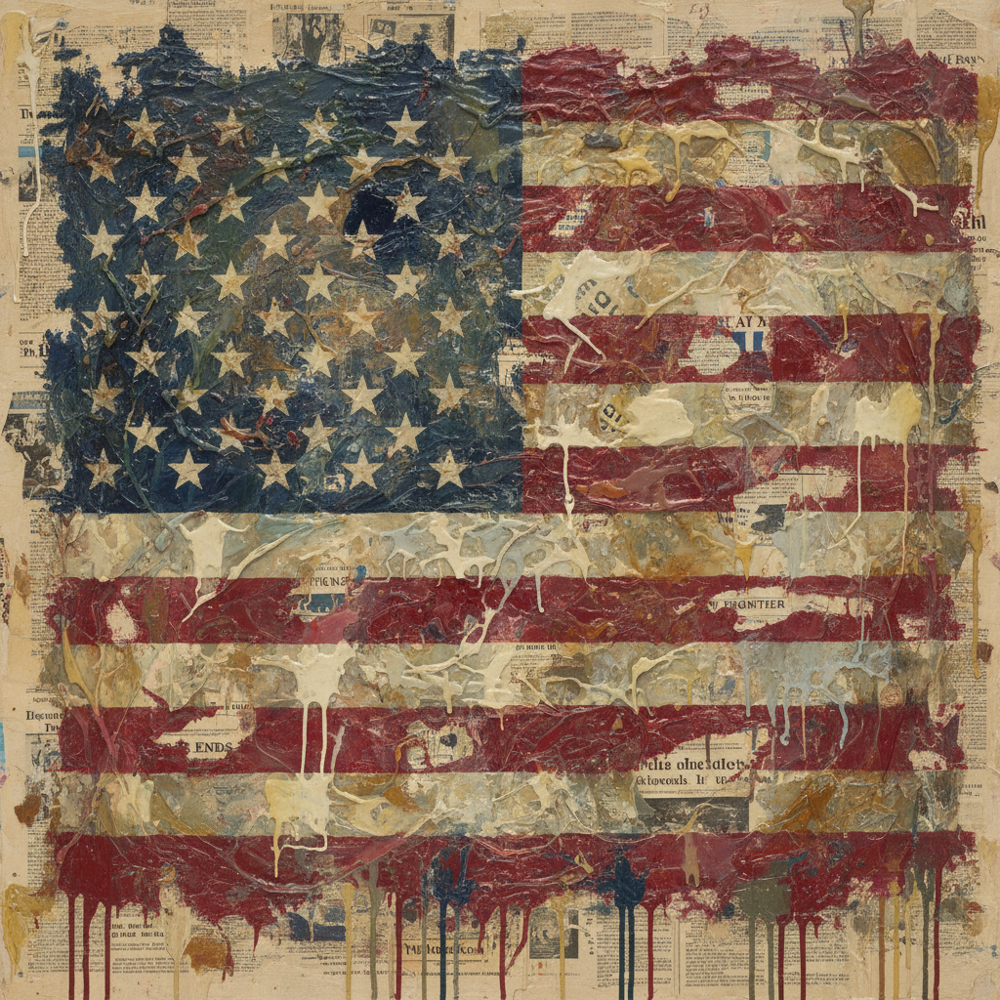

# Jasper Johns 贾斯珀·约翰斯

> **流派**: 新达达 · 波普艺术先驱  
> **时期**: 1930–至今 美国  
> **关键词**: 旗帜、靶子、数字、蜡画法、符号与物

## 概述

贾斯珀·约翰斯是20世纪下半叶最重要的美国艺术家之一。他选择"已经被人知道的东西"——旗帜、靶子、数字、字母——作为绘画主题，从而消除了再现与抽象之间的区别。一面旗帜既是一幅画，也是一面旗帜本身。这种"既是又不是"的暧昧性彻底改变了人们对图像的理解。

## 视觉特征

- **蜡画法**: 用热蜡混合颜料，表面有丰富的物质肌理
- **熟悉符号**: 美国国旗、靶子、数字0-9、字母表
- **灰色调**: 大量使用灰色，拒绝情感表达
- **报纸拼贴**: 蜡层下隐约可见的报纸碎片
- **重复变奏**: 同一主题反复绘制，每次略有不同

## 代表作品

- 《旗帜》(Flag, 1954–55)
- 《三面旗帜》(Three Flags, 1958)
- 《靶子与四张脸》(Target with Four Faces, 1955)
- 《数字0到9》(0 through 9, 1961)
- 《地图》(Map, 1961)

## 历史影响

约翰斯与劳森伯格一起终结了抽象表现主义的统治，为波普艺术和观念艺术开辟了道路。他提出的核心问题——"什么是看？什么是知道？什么是画？"——至今仍是当代艺术的基本命题。

## 相关风格

- [Robert Rauschenberg 罗伯特·劳森伯格](robert-rauschenberg.md)
- [Pop Art 波普艺术](pop-art.md)
- [Neo-Dada 新达达](neo-dada.md)
