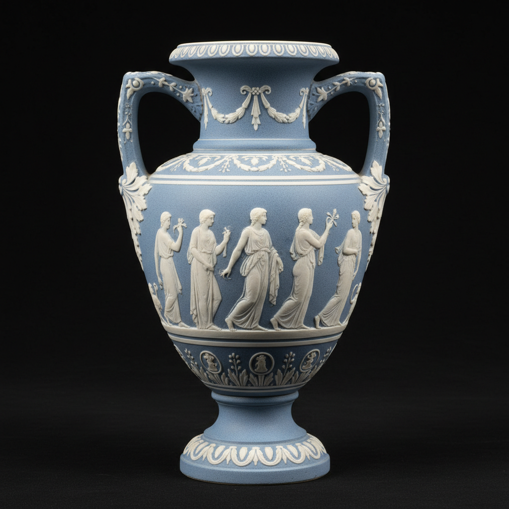

# Jasperware Art 碧玉陶艺术

> "Jasperware is sculpture in ceramic — Wedgwood's unglazed stoneware body, tinted throughout with metallic oxides in blue, green, lilac, or black, receives applied white relief decoration modeled with the precision of a cameo, creating objects that combine the severity of Neoclassical taste with the delicacy of a jewel, each piece a miniature monument to the antique world rendered in fired clay." — Unknown

## 概述

碧玉陶艺术（Jasperware Art）是乔赛亚·韦奇伍德于1774年发明的一种独特的无釉炻器——以其细腻的有色胎体（最著名的是蓝色）上贴附白色浮雕装饰为特征。碧玉陶的白色浮雕通常表现古典神话场景、人物和装饰纹样，是新古典主义风格在陶瓷中最完美的体现，至今仍是韦奇伍德最具标志性的产品。

碧玉陶艺术的实践包括：1）配方——独特的硫酸钡炻器配方；2）着色——用金属氧化物给胎体着色；3）模制浮雕——用模具制作白色浮雕装饰；4）贴附——将浮雕贴附在有色胎体上；5）烧制——高温烧制使之坚硬；6）无釉——不施釉保持哑光质感；7）当代碧玉陶——将传统工艺与现代设计结合。

## 核心特征

| 特征 | 描述 |
|------|------|
| 无釉 | 无釉的哑光表面 |
| 双色 | 有色底白色浮雕 |
| 浮雕 | 精细的白色浮雕 |
| 新古典 | 新古典主义风格 |
| 韦奇伍德 | 韦奇伍德的标志 |
| 蓝色 | 最著名的蓝色底 |

## 视觉特征

- **蓝白**：经典的蓝底白色浮雕
- **哑光**：无釉的哑光质感
- **浮雕**：精细的浮雕细节
- **古典**：古典主义的题材
- **优雅**：优雅精致的整体效果
- **对比**：底色与白色的对比

## 代表作品

| 作品 | 艺术家/文化 | 年代 | 意义 |
|------|-------------|------|------|
| *Portland Vase copy* | 韦奇伍德 | 1790年 | 波特兰花瓶复制品 |
| *Wedgwood blue jasper* | 英国 | 1774年起 | 韦奇伍德蓝色碧玉陶 |
| *Jasper medallions* | 英国 | 18世纪 | 碧玉陶浮雕章 |
| *Wedgwood cameos* | 英国 | 18-19世纪 | 韦奇伍德浮雕宝石 |
| *Contemporary jasperware* | 英国 | 当代 | 当代碧玉陶 |

## 历史时间线

| 时期 | 事件 |
|------|------|
| 1774年 | 韦奇伍德发明碧玉陶 |
| 1780-90年代 | 碧玉陶的黄金时代 |
| 1790年 | 波特兰花瓶的碧玉陶复制 |
| 19世纪 | 碧玉陶的持续生产 |
| 当代 | 韦奇伍德碧玉陶的延续 |

## 中国语境

碧玉陶与中国的陶瓷传统有一定的关联。中国的紫砂壶——同样是无釉的精细炻器，与碧玉陶有相似的材料理念。中国的德化白瓷浮雕——精细的白色浮雕装饰与碧玉陶的白色浮雕有对应关系。中国的陶瓷收藏界——对韦奇伍德碧玉陶有深入的了解和收藏。中国的陶瓷教育中，碧玉陶作为18世纪陶瓷创新的代表——在相关课程中介绍。中国当代的陶艺家——有一些受碧玉陶启发进行双色浮雕的创作。

## AI生成概念图

## 与其他风格的关系

- **Wedgwood** → 韦奇伍德
- **Creamware** → 奶油色陶
- **Neoclassical** → 新古典主义
- **Cameo** → 浮雕宝石
- **Relief Sculpture** → 浮雕
- **Stoneware** → 炻器

---

*浮光艺志 | Chronicle of Artistry*
