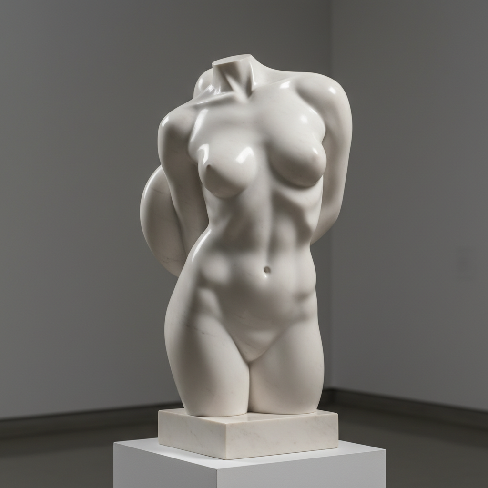

# Jean Arp 让·阿尔普

> **流派**: 达达主义 · 超现实主义 · 有机抽象  
> **时期**: 1886–1966 法国/德国  
> **关键词**: 生物形态、偶然法则、有机浮雕、自然生长

## 概述

让·阿尔普是达达运动的创始人之一，也是有机抽象雕塑的先驱。他追求一种"自然生长"的艺术——形态不是被设计出来的，而是像植物一样自然涌现。他的作品介于抽象与自然之间，像是被水流打磨的鹅卵石或正在分裂的细胞。

## 视觉特征

- **生物形态**: 像细胞、云朵、躯干的有机曲线
- **光滑表面**: 打磨至极致的大理石或青铜
- **偶然构图**: 早期用"偶然法则"（随机落下的纸片）创作
- **浮雕层次**: 木质彩色浮雕，形状层层叠加
- **无题命名**: 作品常以诗意的非描述性标题命名

## 代表作品

- 《按照偶然法则排列的方块》(1917)
- 《人体凝结》系列 (1930s)
- 《牧羊人的云》(1953)
- 《托勒密》(1953)

## 历史影响

阿尔普在达达的破坏性与超现实主义的梦幻之间找到了一条诗意的中间道路。他的有机形态影响了后来的生物形态设计、考尔德的动态雕塑和战后抽象雕塑。

## 相关风格

- [Alexander Calder 亚历山大·考尔德](alexander-calder.md)
- [Henry Moore 亨利·摩尔](henry-moore.md)
- [Joan Miró 胡安·米罗](joan-miro.md)
