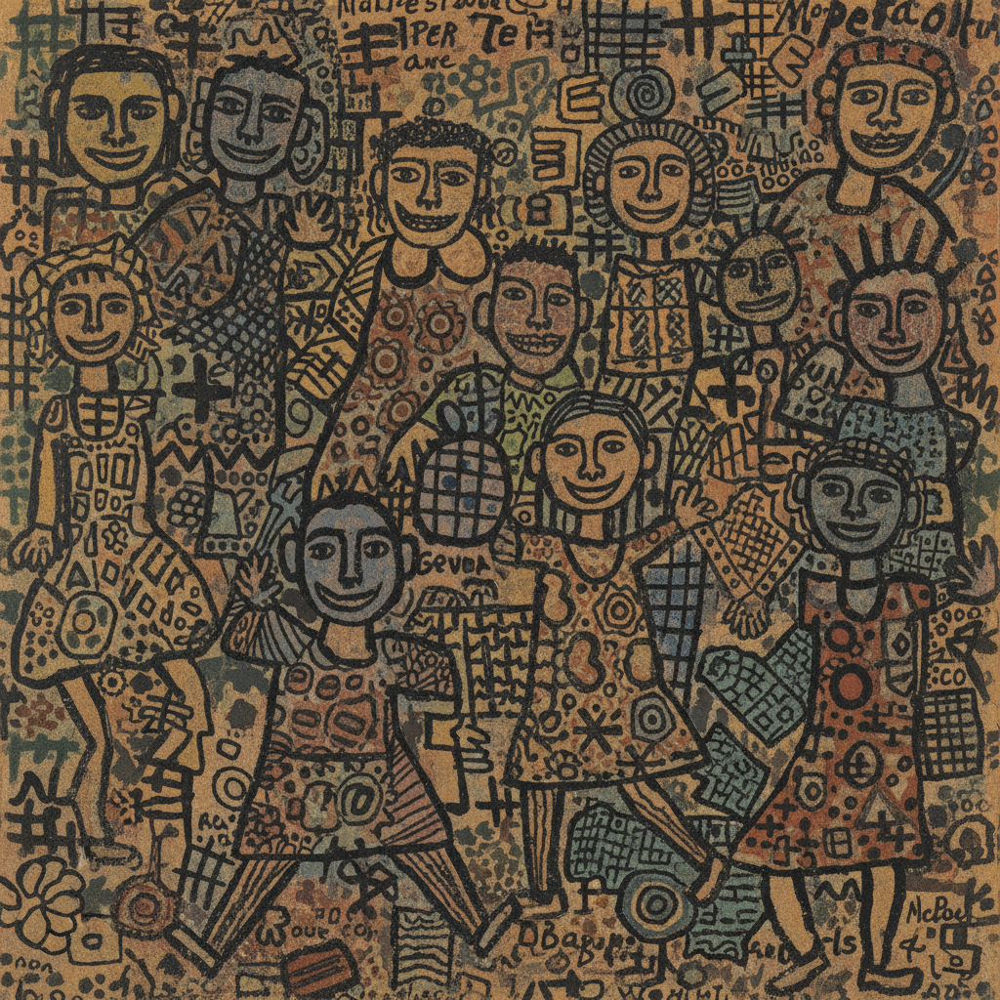

# Jean Dubuffet 让·杜布菲

> **流派**: 原生艺术 (Art Brut) · 非形式艺术  
> **时期**: 1901–1985 法国  
> **关键词**: 原生艺术、厚涂肌理、儿童画风、反美学

## 概述

让·杜布菲是"原生艺术"(Art Brut) 概念的提出者和最重要的实践者。他刻意抛弃学院训练，从精神病患者、儿童和民间艺术中寻找灵感，用厚重的材料和粗犷的手法创造出一种反文化精英主义的艺术语言。

## 视觉特征

- **厚涂肌理**: 混合沙子、泥土、沥青等材料创造浮雕般的表面
- **儿童画风**: 刻意笨拙的人物造型，像孩子的涂鸦
- **密集填充**: 画面被图案和形象密密麻麻地填满
- **粗犷轮廓**: 用粗黑线条勾勒简化的形体
- **反透视**: 完全无视传统空间关系，平面化处理

## 代表作品

- 《乌尔卢普》系列 (1962–1974)
- 《大地之躯》系列 (1950s)
- 《巴黎马戏团》(1961)
- 《四棵树》雕塑 (1972)

## 历史影响

杜布菲挑战了"什么是好的艺术"的标准，为局外人艺术、涂鸦艺术和街头艺术打开了大门。他的原生艺术收藏至今仍是研究非主流创造力的重要资源。

## 相关风格

- [Jean-Michel Basquiat 让-米歇尔·巴斯奎特](basquiat.md)
- [Keith Haring 凯斯·哈林](keith-haring.md)
- [Art Brut 原生艺术](art-brut.md)
