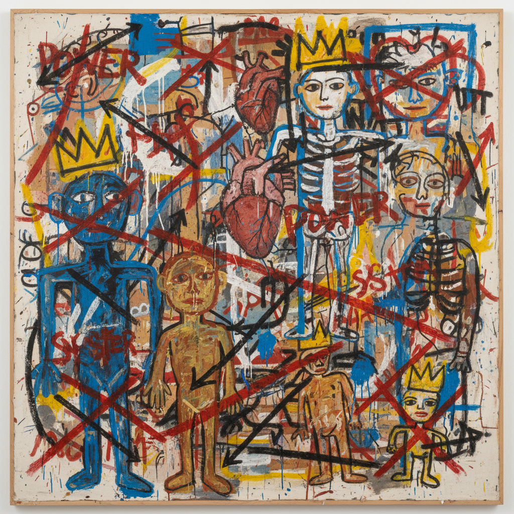

# Jean-Michel Basquiat 巴斯奎特

> "I don't think about art when I'm working. I try to think about life." — Jean-Michel Basquiat

## 概述

让-米歇尔·巴斯奎特（Jean-Michel Basquiat，1960–1988）是美国新表现主义画家，从纽约街头涂鸦艺术家成长为20世纪最重要的当代艺术家之一。他以原始的、充满文字和符号的画作闻名——将非洲裔身份、解剖学、爵士乐、街头文化和艺术史融合在粗犷的画布上，用孩童般的笔触表达深刻的社会批判。

## 核心特征

| 特征 | 描述 |
|------|------|
| 涂鸦文字 | 划掉的单词、箭头、列表 |
| 皇冠符号 | 标志性的三尖皇冠 |
| 骷髅与解剖 | 暴露的骨骼和器官 |
| 原始笔触 | 孩童般的粗犷线条 |
| 文化混搭 | 非洲、爵士、拳击、艺术史 |
| 密集信息 | 画面塞满符号和文字 |

## 代表作品

| 作品 | 年代 | 意义 |
|------|------|------|
| *Untitled (Skull)* | 1981 | 标志性的骷髅头像 |
| *Boy and Dog in a Johnnypump* | 1982 | 街头生活的原始力量 |
| *Dustheads* | 1982 | 人物与文字的密集叠加 |
| *Riding with Death* | 1988 | 最后的杰作 |

## AI生成概念图

## 与其他风格的关系

- **Neo-Expressionism** → 新表现主义的核心人物
- **Street Art** → 从SAMO涂鸦起步
- **Pop Art** → 与沃霍尔的合作
- **African Art** → 非洲视觉传统的当代转化
