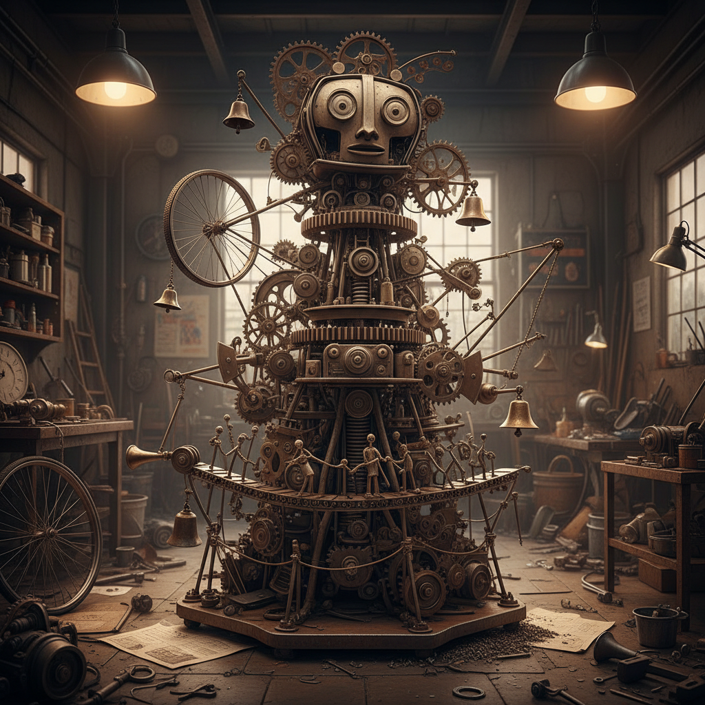

# Jean Tinguely 让·丁格利

> **时期：** 1925–1991  
> **关键词：** 动态雕塑、自毁机器、废铁装置、新现实主义

## 概述

Jean Tinguely 是瑞士雕塑家，以用废弃机械零件和金属垃圾组装的动态雕塑闻名。他的机器作品嘎吱作响地运转，却不生产任何有用的东西——它们是对工业社会生产力崇拜的幽默讽刺。最著名的《向纽约致敬》是一台在MoMA花园中自我毁灭的巨型机器。

## 风格特征

- **动态机械**：作品由电机驱动，持续运动和发出声响
- **废弃材料**：使用回收的齿轮、轮子、管道和金属废料
- **无用功能**：机器运转但不生产任何东西，讽刺效率崇拜
- **自毁倾向**：部分作品设计为在运行中自我毁灭
- **声音元素**：机械运转产生的噪音是作品的重要组成部分

## 代表作品

- *Homage to New York*（1960）
- *Méta-Matics*系列（1959）
- *Eureka*（1964）
- *Fontaine Stravinsky*（1983，与Niki de Saint Phalle合作）

## 概念图

