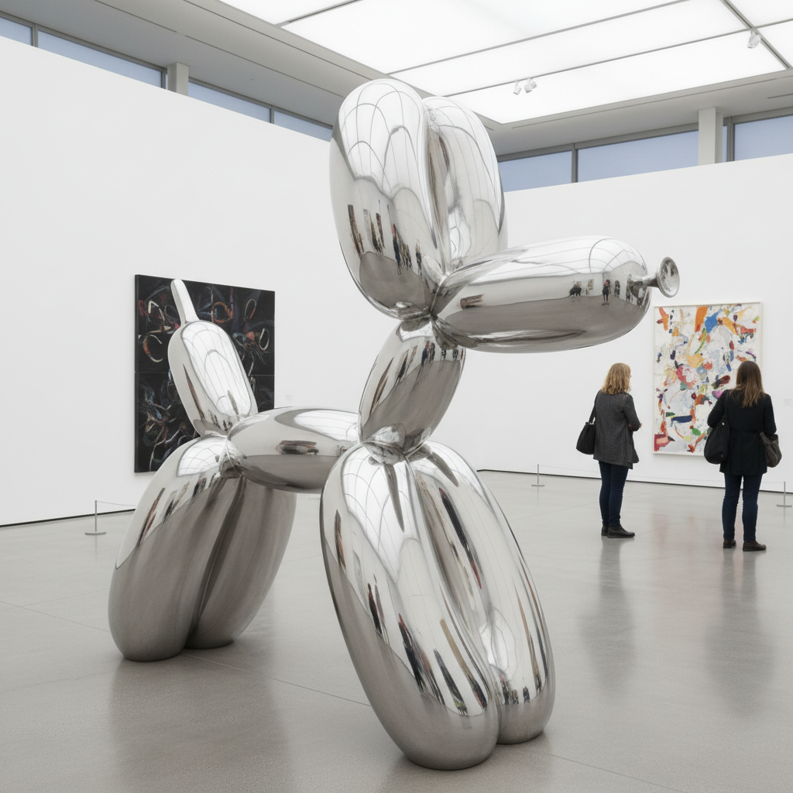

# Jeff Koons 杰夫·昆斯

> "Art to me is a humanitarian act and I believe that there is a responsibility that art should somehow be able to effect mankind." — Jeff Koons

## 概述

杰夫·昆斯（Jeff Koons，1955–）是美国当代艺术家，以将日常消费品和媚俗物件转化为高级艺术闻名。他的巨型不锈钢气球狗、瓷器小摆件和镜面抛光雕塑模糊了高雅与低俗、艺术与商品的界限，成为后现代消费文化最具争议的视觉象征。

## 核心特征

| 特征 | 描述 |
|------|------|
| 气球雕塑 | 不锈钢镜面的气球动物 |
| 媚俗美学 | 将kitsch提升为高级艺术 |
| 镜面抛光 | 完美无瑕的工业表面 |
| 巨大尺幅 | 日常物件的纪念碑化 |
| 消费文化 | 商品作为艺术主题 |
| 工厂生产 | 团队制作的精密工艺 |

## 代表作品

| 作品 | 年代 | 意义 |
|------|------|------|
| *Balloon Dog* | 1994–2000 | 当代艺术的标志性图像 |
| *Rabbit* | 1986 | 不锈钢充气兔的经典 |
| *Michael Jackson and Bubbles* | 1988 | 瓷器媚俗的巅峰 |
| *Tulips* | 1995–2004 | 镜面花朵的公共雕塑 |

## AI生成概念图

## 与其他风格的关系

- **Pop Art** → 沃霍尔之后的消费艺术
- **Readymade** → 杜尚现成品的当代延伸
- **Damien Hirst** → 共享商业化艺术策略
- **Kitsch** → 媚俗美学的学术化
