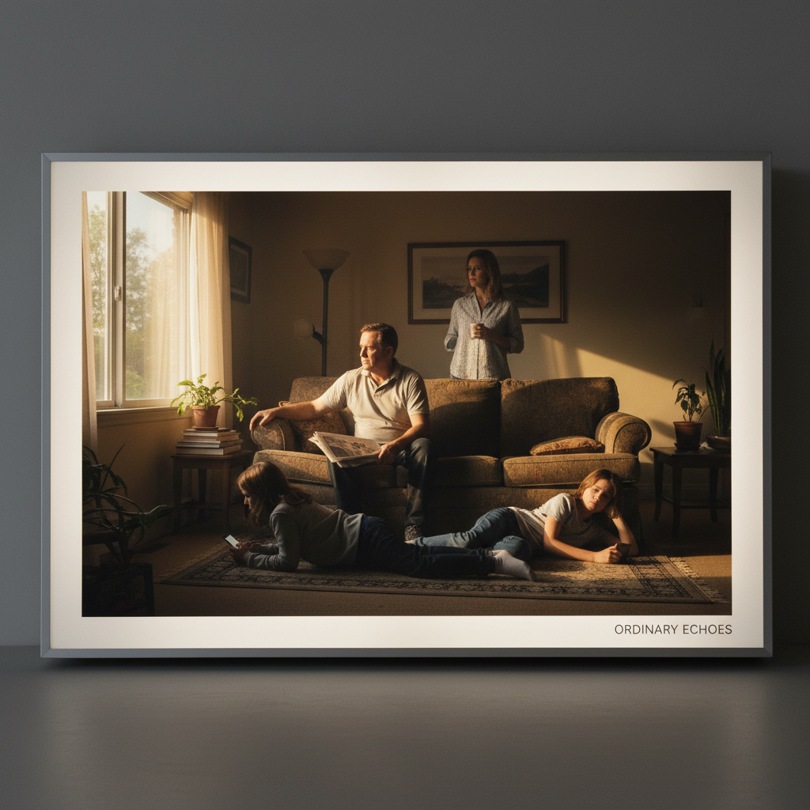

# Jeff Wall 杰夫·沃尔

> **时期：** 1946–至今  
> **关键词：** 灯箱摄影、编导式摄影、电影画面、日常戏剧

## 概述

Jeff Wall 是加拿大艺术家，以大型透明灯箱照片闻名。他的作品看似随意的街头瞬间，实际上是精心编排的"电影剧照"——雇佣演员、搭建场景、后期合成，将摄影提升到与绘画和电影同等的叙事高度。

## 风格特征

- **灯箱展示**：大型透明正片安装在发光灯箱中，如同城市广告牌
- **编导式摄影**：看似纪实的画面实为精心导演
- **电影构图**：借鉴古典绘画和电影的构图法则
- **日常戏剧**：普通人在普通场景中的微妙张力
- **数字合成**：多张底片合成为一个"不可能的瞬间"

## 代表作品

- *A Sudden Gust of Wind (after Hokusai)*（1993）
- *Dead Troops Talk*（1992）
- *Mimic*（1982）
- *After "Invisible Man" by Ralph Ellison, the Prologue*（1999–2001）

## 概念图

