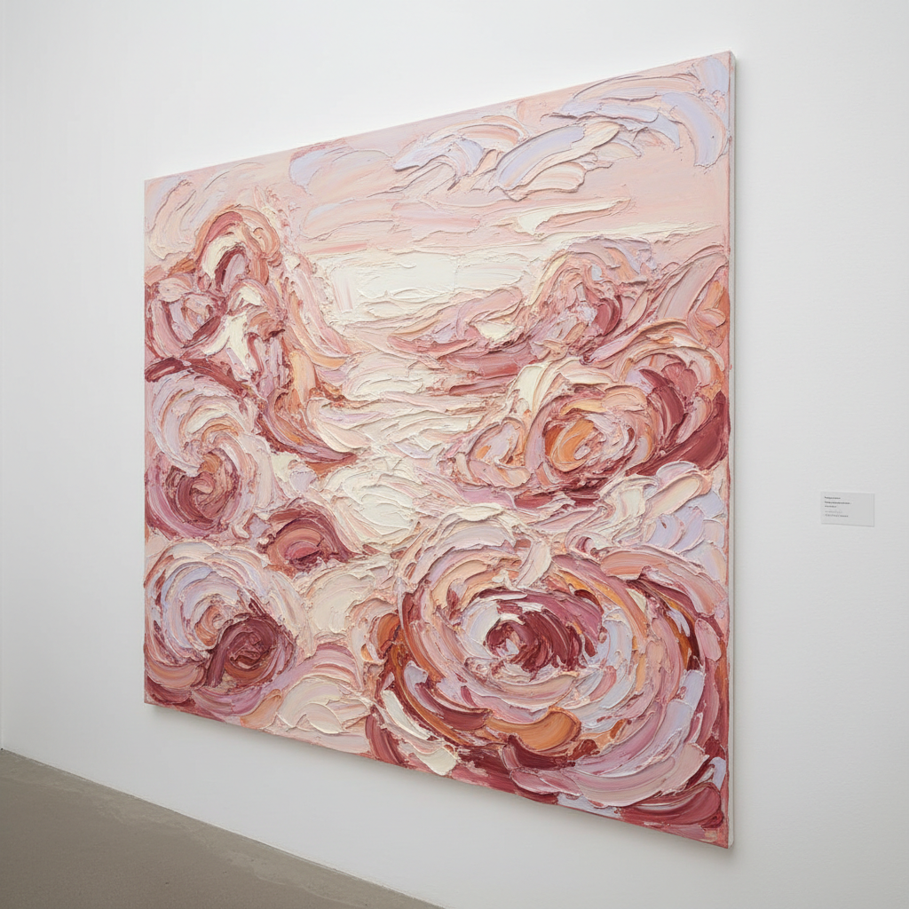

# Jenny Saville 珍妮·萨维尔

> **流派**: 当代绘画 · YBA · 具象表现主义  
> **时期**: 1970–至今 英国  
> **关键词**: 巨幅肉体、女性身体、厚涂颜料、解剖学

## 概述

珍妮·萨维尔以巨幅女性裸体画闻名——她的人物通常是超大尺寸的肥胖身体，从极近的仰视角度描绘，肉体几乎溢出画面。她用厚重的油彩堆叠出皮肤的质感——青紫的淤血、粉红的褶皱、黄色的脂肪——将女性身体从理想化的凝视中解放出来，呈现其原始的物质性和力量感。

## 视觉特征

- **巨大尺幅**: 画面通常超过3米高
- **仰视角度**: 从下方看向巨大的身体
- **厚涂颜料**: 油彩堆积如同真实的肉体
- **肉色光谱**: 粉红、紫色、黄色、蓝色的皮肤
- **解剖学精确**: 基于医学图像和手术照片

## 代表作品

- 《策略》(Strategy, 1994)
- 《支撑》(Propped, 1992) — 拍卖价950万英镑
- 《转变》(Shift, 1996–97)
- 《通道》(Passage, 2004)

## 历史影响

萨维尔重新定义了女性裸体在绘画中的意义——不再是被观看的客体，而是占据空间的主体力量。她证明了具象绘画在当代仍然可以具有颠覆性，也是在世女性画家中作品拍卖价最高的。

## 相关风格

- [Lucian Freud 卢西安·弗洛伊德](lucian-freud.md)
- [YBA 英国青年艺术家](yba.md)
- [Figurative Expressionism 具象表现主义](figurative-expressionism.md)
