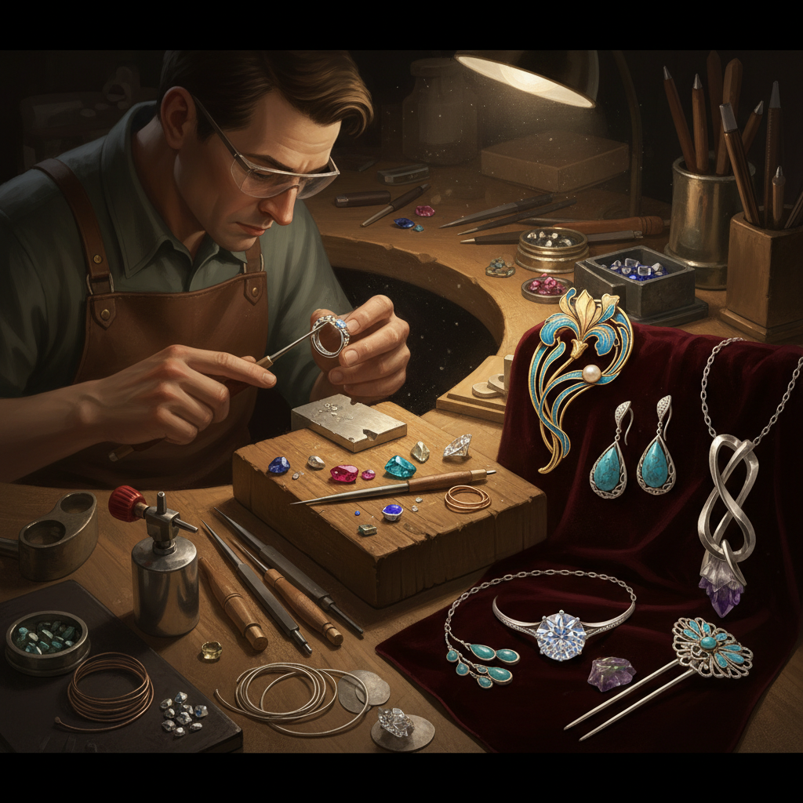

# Jewelry Making 珠宝制作

> "Jewelry making is sculpture at its most intimate — art worn against the skin, carried through life, marking moments that matter." — Unknown

## 概述

珠宝制作（Jewelry Making）是使用贵金属（金、银、铂）、宝石、珐琅和其他材料制作装饰性佩戴物品的工艺。珠宝制作是人类最古老的艺术形式之一——最早的珠宝可追溯到10万年前的贝壳项链。珠宝制作融合了多种技法：铸造（casting）、锻造（forging）、焊接（soldering）、镶嵌（setting）、雕刻（engraving）、珐琅（enameling）和编织（wire wrapping）。从古埃及法老的黄金面具到当代概念珠宝，珠宝既是身份和财富的象征，也是个人表达和艺术创作的媒介。

珠宝制作的哲学在于：微缩的永恒——在最小的尺度上创造最精致的美，让艺术成为身体的一部分。

## 核心特征

| 特征 | 描述 |
|------|------|
| 贵金属 | 金银铂等贵金属 |
| 宝石 | 宝石的镶嵌 |
| 精密 | 极其精密的工艺 |
| 佩戴 | 为佩戴而设计 |
| 永恒 | 材料的永恒性 |
| 象征 | 丰富的象征意义 |

## 视觉特征

- **光泽**：金属和宝石的光泽
- **精细**：极其精细的工艺
- **闪烁**：宝石的闪烁
- **造型**：精美的造型设计
- **质感**：金属的质感
- **小巧**：精致小巧的尺度

## 代表作品

| 作品 | 艺术家 | 年代 | 意义 |
|------|--------|------|------|
| *Tutankhamun's jewelry* | 匿名 | 公元前1323年 | 古埃及珠宝 |
| *René Lalique Art Nouveau* | Lalique | 1890s+ | 新艺术珠宝 |
| *Cartier creations* | Cartier | 1847+ | 高级珠宝 |
| *Alexander Calder jewelry* | Calder | 1930s+ | 艺术家珠宝 |
| *Contemporary art jewelry* | Various | 当代 | 当代概念珠宝 |

## 历史时间线

| 时期 | 事件 |
|------|------|
| 10万年前 | 最早的贝壳珠宝 |
| 古埃及 | 黄金珠宝的辉煌 |
| 中世纪 | 宗教珠宝和王冠 |
| 19世纪 | 新艺术珠宝运动 |
| 20世纪 | 现代珠宝设计 |
| 当代 | 当代概念珠宝和独立设计师 |

## 中国语境

中国有极其悠久的珠宝传统——从商周的玉器到汉代的金银器、从唐代的金银首饰到明清的点翠和花丝镶嵌。中国传统珠宝工艺包括：花丝镶嵌（国家级非遗）、点翠、烧蓝、錾刻、累丝等。当代中国的珠宝产业蓬勃发展——深圳是中国最大的珠宝加工和贸易中心。中国的珠宝设计教育也在快速发展，中央美术学院、中国地质大学等院校培养了大量珠宝设计人才。当代中国珠宝设计师将传统工艺与现代设计理念结合，在国际珠宝界崭露头角。

## AI生成概念图

## 与其他风格的关系

- **Metalwork** → 金属工艺
- **Enameling** → 珐琅
- **Gem Cutting** → 宝石切割
- **Beadwork** → 串珠
- **Sculpture** → 雕塑（微缩）
- **Wearable Art** → 可穿戴艺术

---

*浮光艺志 | Chronicle of Artistry*
