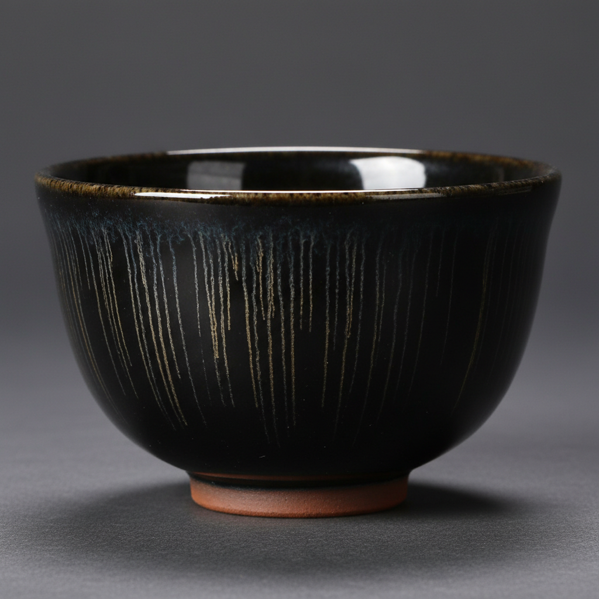

# Jian Ware Art 建窑艺术

> "Jian ware is darkness illuminated from within — black glaze transformed by iron crystals into patterns that the Chinese named after hare's fur, oil spots, and partridge feathers, each bowl a miniature cosmos where metallic streaks radiate like stars against a night sky, the preferred vessel of Song dynasty tea connoisseurs who understood that dark glaze makes pale tea foam glow like jade against obsidian." — Unknown

## 概述

建窑艺术（Jian Ware Art）是中国宋代福建省建阳地区生产的黑釉茶碗艺术，以其独特的铁结晶纹理著称于世。建窑黑釉茶碗是宋代斗茶文化的核心器物——其深黑色的釉面上自然形成兔毫纹、油滴纹、曜变纹等铁结晶效果，每一种纹理都是窑火自然造就的独特艺术。建窑茶碗在日本被称为"天目"，是日本茶道中最珍贵的茶碗类型。

建窑艺术的核心要素包括：1）黑釉基底——深沉的黑色铁釉；2）兔毫纹——如兔毛般的细丝纹理；3）油滴纹——如油滴般的银色斑点；4）曜变纹——最珍贵的彩色光晕；5）斗茶文化——宋代斗茶的专用器；6）铁结晶——铁在冷却中的结晶；7）天目传统——日本茶道的珍品。

## 核心特征

| 特征 | 描述 |
|------|------|
| 黑釉基底 | 深沉的黑色铁釉 |
| 兔毫纹 | 如兔毛般细丝纹 |
| 油滴纹 | 如油滴般银色斑 |
| 曜变纹 | 最珍贵彩色光晕 |
| 斗茶文化 | 宋代斗茶专用 |
| 铁结晶 | 铁的结晶效果 |

## 视觉特征

- **深黑底色**：深沉的黑色釉面
- **银色丝纹**：兔毫的银色细丝
- **银色斑点**：油滴的银色圆斑
- **彩色光晕**：曜变的彩虹光晕
- **厚重器形**：厚实的碗形
- **铁足露胎**：底部露出深色胎

## 代表作品

| 作品 | 艺术家/文化 | 年代 | 意义 |
|------|-------------|------|------|
| *曜变天目* | 建窑 | 南宋 | 世界仅存三件（日本国宝） |
| *油滴天目* | 建窑 | 宋代 | 油滴纹的经典 |
| *兔毫盏* | 建窑 | 宋代 | 最常见的建盏类型 |
| *银兔毫* | 建窑 | 宋代 | 银色兔毫纹 |
| *当代建盏* | 当代建盏艺人 | 当代 | 建盏的当代复兴 |

## 历史时间线

| 时期 | 事件 |
|------|------|
| 晚唐五代 | 建窑的创烧 |
| 北宋 | 建窑的发展 |
| 南宋 | 建窑的鼎盛 |
| 元代 | 建窑的衰落 |
| 当代 | 建盏的复兴热潮 |

## 中国语境

建窑是中国茶文化与陶瓷艺术完美结合的典范。宋代斗茶文化的流行直接推动了建窑的繁荣——斗茶需要观察茶汤的颜色和泡沫，黑色的建盏能够最好地衬托白色的茶沫。宋徽宗在《大观茶论》中明确推崇建盏——"盏色贵青黑，玉毫条达者为上"。建窑的曜变天目是中国陶瓷中最神秘的品种——世界上仅存三件完整的曜变天目，全部收藏在日本，被列为日本国宝。建盏在当代中国经历了强劲的复兴——建阳地区的建盏产业蓬勃发展，当代建盏艺人在传统基础上不断创新，使这一千年传统焕发新的生命力。

## AI生成概念图

## 与其他风格的关系

- **Tenmoku** → 天目
- **Tea Culture** → 茶文化
- **Iron Glaze** → 铁釉
- **Crystal Glaze** → 结晶釉
- **Song Dynasty** → 宋代陶瓷
- **Japanese Tea** → 日本茶道

---

*浮光艺志 | Chronicle of Artistry*
