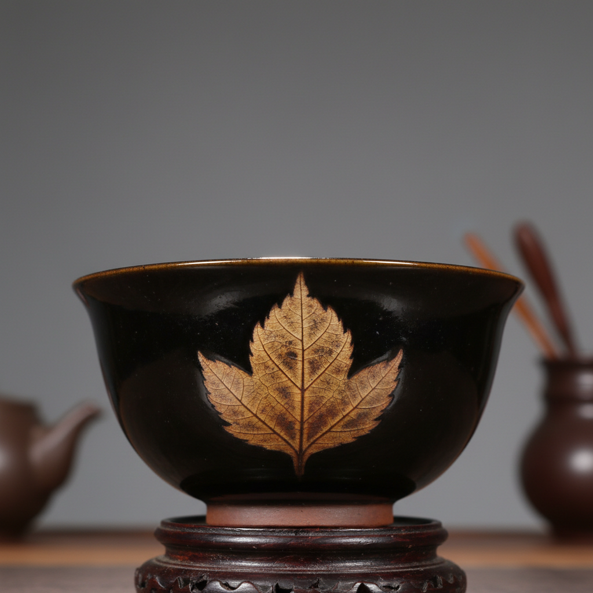

# Jizhou Ware Art 吉州窑艺术

> "Jizhou ware is nature pressed into glaze — real leaves laid on wet glaze and burned away in the kiln to leave their perfect silhouette in lighter tone against dark ground, tortoiseshell patterns created by splashing one glaze over another, paper-cut designs transferred to ceramic with a directness that makes every piece feel like a page from a folk artist's sketchbook fired into permanence." — Unknown

## 概述

吉州窑艺术（Jizhou Ware Art）是中国宋代江西省吉安地区生产的独特装饰陶瓷艺术，以其创新的装饰技法著称。吉州窑最著名的技法包括：木叶贴花（将真实树叶贴在釉面上烧制）、剪纸贴花（将剪纸图案转印到釉面）、玳瑁釉（模仿玳瑁壳纹理的釉面效果）等。吉州窑将民间工艺与陶瓷技术巧妙结合，创造出独一无二的装饰效果。

吉州窑艺术的核心要素包括：1）木叶贴花——真实树叶的贴花烧制；2）剪纸贴花——剪纸图案的转印；3）玳瑁釉——模仿玳瑁的釉面；4）民间创新——民间工艺的创新应用；5）黑釉装饰——黑釉上的多种装饰；6）茶碗为主——以茶碗为主要产品；7）独特技法——独一无二的装饰技法。

## 核心特征

| 特征 | 描述 |
|------|------|
| 木叶贴花 | 真实树叶贴花 |
| 剪纸贴花 | 剪纸图案转印 |
| 玳瑁釉 | 模仿玳瑁纹理 |
| 民间创新 | 民间工艺创新 |
| 黑釉装饰 | 黑釉上的装饰 |
| 独特技法 | 独一无二技法 |

## 视觉特征

- **木叶纹**：碗内清晰的树叶轮廓
- **玳瑁纹**：如玳瑁壳般的斑纹
- **剪纸图案**：民间剪纸的图案
- **黑褐底色**：深色的釉面底色
- **自然印记**：自然物的直接印记
- **民间趣味**：充满民间生活趣味

## 代表作品

| 作品 | 艺术家/文化 | 年代 | 意义 |
|------|-------------|------|------|
| *木叶天目盏* | 吉州窑 | 宋代 | 木叶贴花的经典 |
| *玳瑁釉盏* | 吉州窑 | 宋代 | 玳瑁釉的代表 |
| *剪纸贴花盏* | 吉州窑 | 宋代 | 剪纸贴花技法 |
| *鹧鸪斑盏* | 吉州窑 | 宋代 | 鹧鸪斑纹理 |
| *彩绘瓷枕* | 吉州窑 | 宋代 | 彩绘装饰 |

## 历史时间线

| 时期 | 事件 |
|------|------|
| 晚唐五代 | 吉州窑的创烧 |
| 北宋 | 吉州窑的发展 |
| 南宋 | 吉州窑的鼎盛 |
| 元代 | 吉州窑的衰落 |
| 当代 | 吉州窑技法的研究复兴 |

## 中国语境

吉州窑是中国陶瓷中最具创新精神的窑口之一——它将民间的剪纸、树叶等日常材料直接应用于陶瓷装饰，创造出前所未有的艺术效果。木叶天目盏是吉州窑最著名的产品——将一片真实的桑叶或菩提叶贴在碗内的黑釉上，烧制后叶子的有机物烧尽，留下叶脉的清晰轮廓，如同一片永恒的秋叶凝固在碗中。这种将自然物直接转化为装饰的手法体现了中国民间艺术的智慧和创造力。吉州窑的玳瑁釉通过在黑釉上泼洒黄釉，形成如玳瑁壳般的美丽斑纹。吉州窑证明了中国陶瓷的创新不仅来自宫廷和文人，更来自民间工匠的智慧和想象力。

## AI生成概念图

## 与其他风格的关系

- **Jian Ware** → 建窑
- **Tenmoku** → 天目
- **Folk Art** → 民间艺术
- **Paper Cut** → 剪纸
- **Leaf Decoration** → 叶纹装饰
- **Tea Culture** → 茶文化

---

*浮光艺志 | Chronicle of Artistry*
