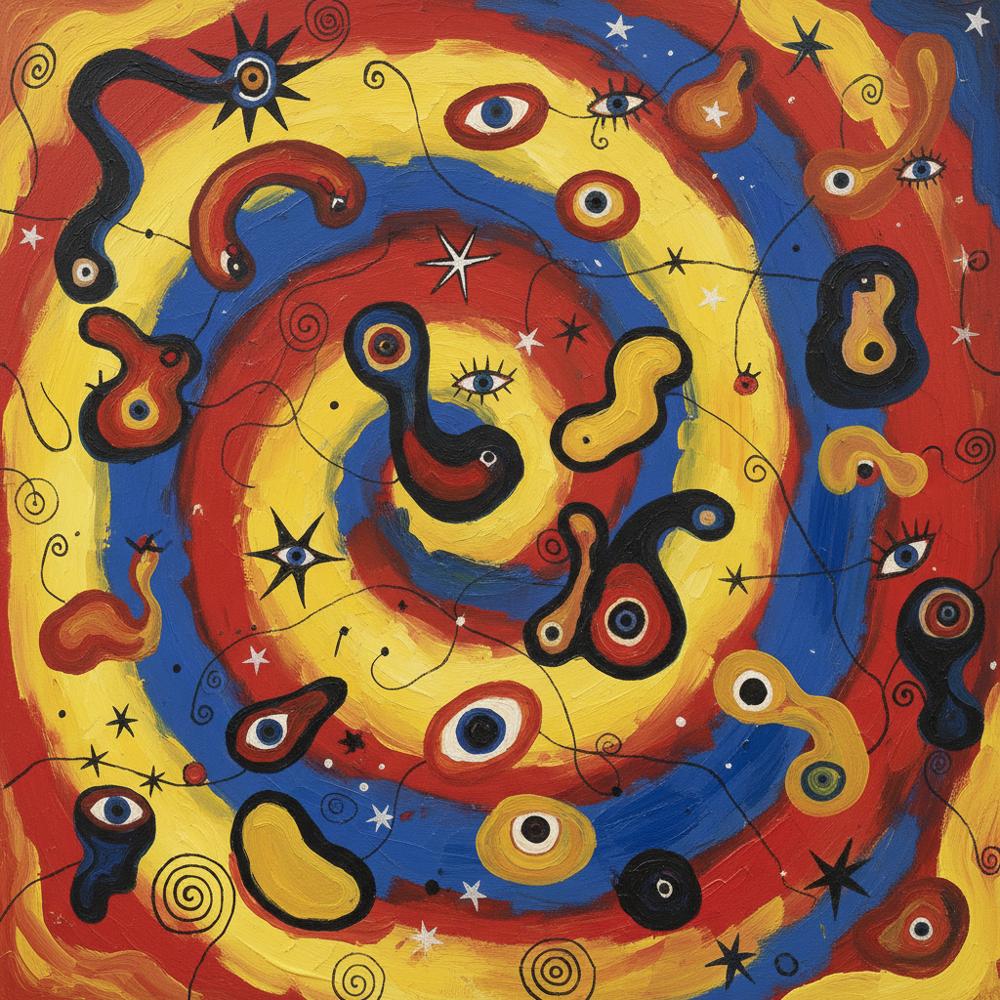

# Joan Miró 米罗

> "I try to apply colors like words that shape poems, like notes that shape music." — Joan Miró

## 概述

胡安·米罗（Joan Miró，1893–1983）是西班牙/加泰罗尼亚画家、雕塑家和陶艺家，以独特的生物形态抽象闻名。他的画面充满自由漂浮的有机形状、星星、眼睛和线条——用孩童般的天真和诗意的想象力创造了一个介于抽象与具象之间的宇宙，将绘画变成视觉诗歌。

## 核心特征

| 特征 | 描述 |
|------|------|
| 生物形态 | 自由漂浮的有机形状 |
| 星星与眼睛 | 标志性的宇宙符号 |
| 原色纯粹 | 红黄蓝黑的大胆配色 |
| 孩童天真 | 看似简单实则精心的线条 |
| 诗意想象 | 绘画作为视觉诗歌 |
| 自动书写 | 超现实主义的自发创作 |

## 代表作品

| 作品 | 年代 | 意义 |
|------|------|------|
| *The Farm* | 1921–22 | 从写实到抽象的转折 |
| *Harlequin's Carnival* | 1924–25 | 超现实主义的欢乐 |
| *Constellations* series | 1940–41 | 战时的宇宙冥想 |
| *Blue I, II, III* | 1961 | 极简的诗意巅峰 |

## AI生成概念图

## 与其他风格的关系

- **Surrealism** → 超现实主义的自动书写分支
- **Abstract Expressionism** → 影响了美国抽象表现主义
- **Calder** → 与考尔德共享生物形态
- **Children's Art** → 回归原始创造力
