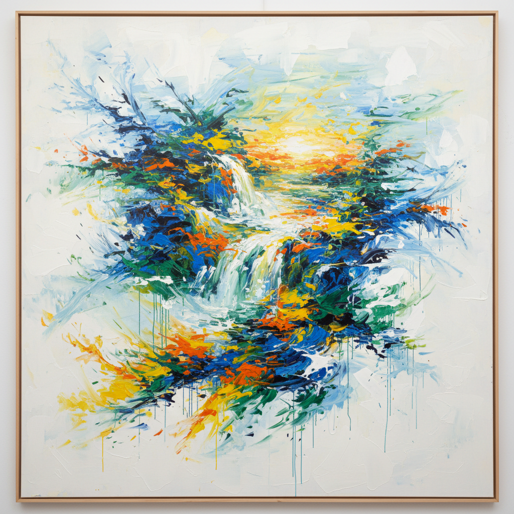

# Joan Mitchell 琼·米切尔

> **时期：** 1925–1992  
> **关键词：** 抒情抽象、风景记忆、多联画、第二代抽象表现主义

## 概述

Joan Mitchell 是美国画家，第二代抽象表现主义的核心人物。她在法国生活和工作超过30年，以大尺幅的抒情抽象绘画闻名。她的作品将风景的记忆——光线、水面、树木、季节——转化为激烈的色彩和笔触，既是对自然的回应，也是纯粹的绘画行为。

## 风格特征

- **抒情色彩**：以蓝、绿、黄、橙为主，色彩选择基于对风景的情感记忆
- **大尺幅多联画**：频繁创作双联或三联画，画面如同展开的全景
- **中心构图**：笔触常集中于画面中心，边缘留白，如同漂浮的色彩岛屿
- **速度与力量**：笔触兼具速度和重量，每一笔都是身体动作的记录
- **风景参照**：虽然是抽象画，但始终以具体的风景记忆为出发点

## 代表作品

- *La Grande Vallée*（1983–84，系列）
- *Sunflowers*（1990–91）
- *No Rain*（1976）
- *Edrita Fried*（1981）

## 历史意义

Mitchell 证明了抽象表现主义不是一个已经结束的运动，而是一种可以持续发展的绘画语言。她在男性主导的纽约画派中坚持自己的道路，如今被认为是20世纪最重要的抽象画家之一。

## 概念图

