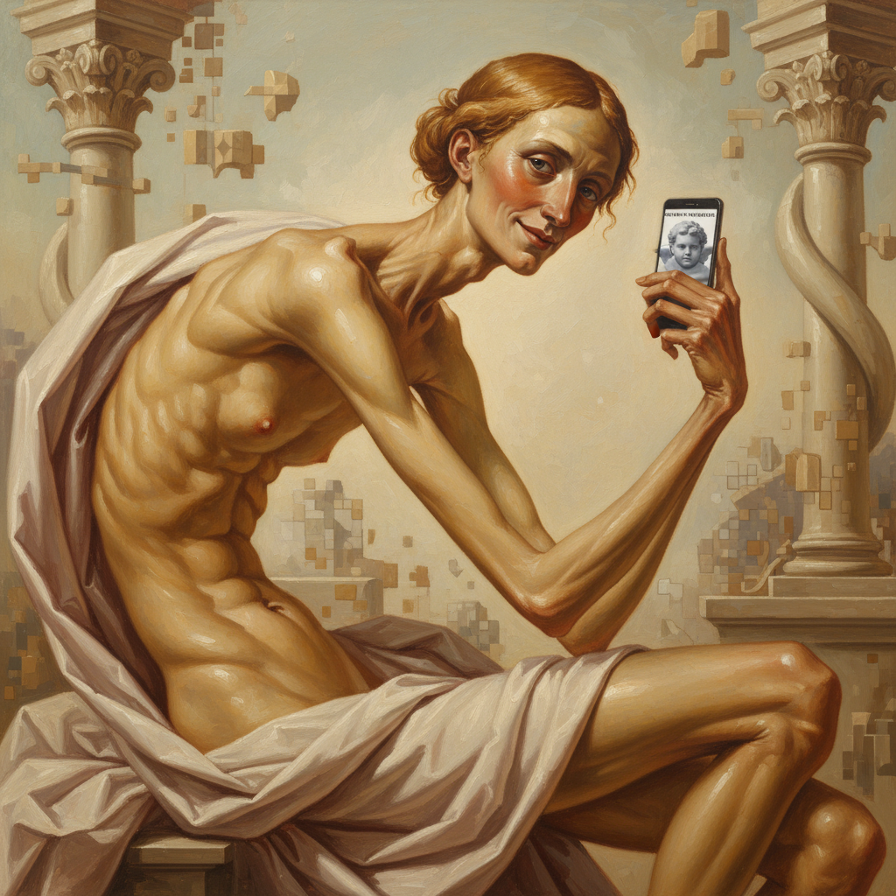

# John Currin 约翰·柯林

> **时期：** 1962–至今  
> **关键词：** 技法炫耀、讽刺美人、古典与色情、矫饰主义回响

## 概述

John Currin 是美国当代画家，以精湛的古典油画技法描绘当代女性形象而闻名。他的作品融合了文艺复兴大师（克拉纳赫、丁托列托）的技巧与当代消费文化的审美，在美与丑、崇高与低俗之间制造持续的张力。

## 风格特征

- **古典技法**：多层罩染、透明釉彩，表面光滑如瓷器
- **身体夸张**：女性形象常被拉长、丰满化或扭曲，介于理想化与漫画之间
- **讽刺距离**：画面既是对美的致敬，也是对美的嘲讽，观者无法确定艺术家的态度
- **色调温暖**：偏爱蜂蜜色、象牙白和玫瑰粉，营造"老大师"般的光泽
- **构图引用**：频繁引用艺术史经典构图，将其置于当代语境

## 代表作品

- *Bea Arthur Naked*（1991）
- *Thanksgiving*（2003）
- *The Cripple*（1997）
- *Nice 'n Easy*（1999）

## 历史意义

Currin 在1990年代重新将技法和美感带回当代绘画讨论，同时引发了关于男性凝视、物化和绘画中的权力关系的持续争论。他证明了"画得好"本身可以是一种颠覆策略。

## 概念图

