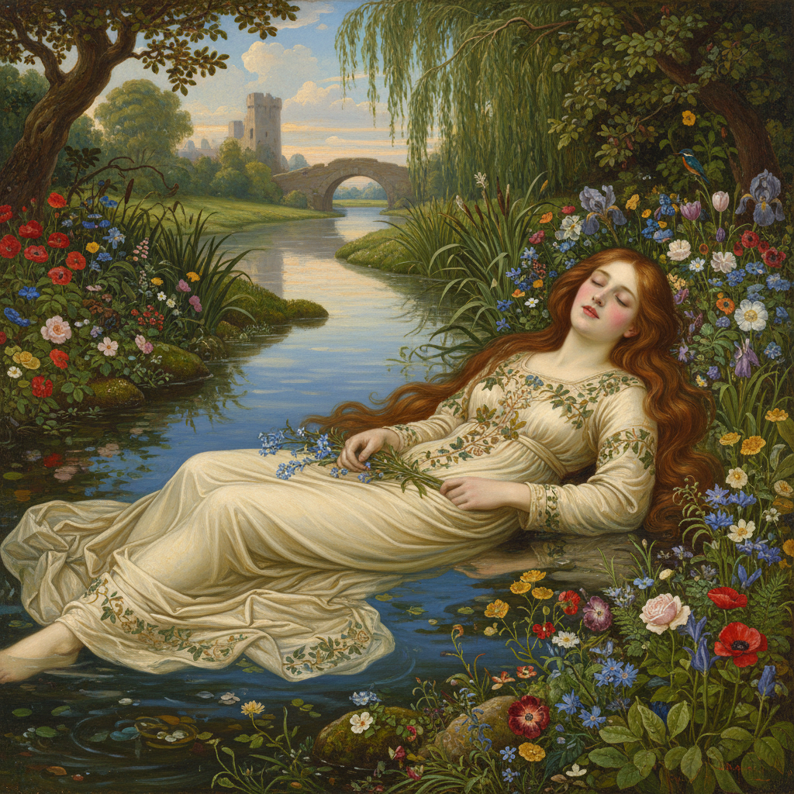

# John Everett Millais 米莱斯

> "A great artist is always before his time or behind it." — J.E. Millais

## 概述

约翰·埃弗里特·米莱斯（John Everett Millais，1829–1896）是英国画家，前拉斐尔派兄弟会的联合创始人，后来成为皇家艺术学院院长。他以极其精细的自然主义和文学题材闻名——早期作品以惊人的细节描绘莎士比亚和丁尼生的场景，后期转向更为流畅的肖像画和风景画。

## 核心特征

| 特征 | 描述 |
|------|------|
| 极致细节 | 每片叶子都精确可辨 |
| 文学题材 | 莎士比亚、丁尼生的场景 |
| 自然主义 | 户外写生的真实光线 |
| 鲜艳色彩 | 宝石般的明亮调性 |
| 叙事性 | 讲述故事的画面 |
| 技巧天才 | 11岁入学皇家艺术学院 |

## 代表作品

| 作品 | 年代 | 意义 |
|------|------|------|
| *Ophelia* | 1851–52 | 前拉斐尔派的最高杰作 |
| *Christ in the House of His Parents* | 1849–50 | 引发争议的宗教写实 |
| *Autumn Leaves* | 1856 | 纯粹情绪的风景 |
| *Bubbles* | 1886 | 维多利亚时代的童真 |

## AI生成概念图

## 与其他风格的关系

- **Pre-Raphaelite** → 前拉斐尔派联合创始人
- **Naturalism** → 英国自然主义的先驱
- **Academic Art** → 后期回归学院传统
- **Photography** → 与早期摄影的精确性共鸣
