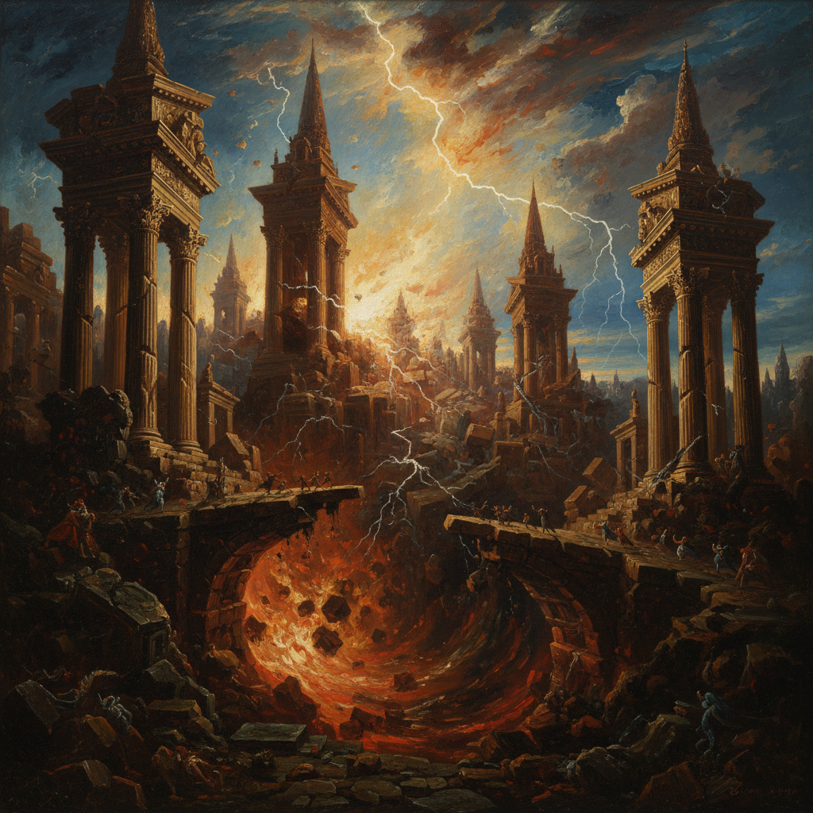

# John Martin 约翰·马丁

> "I have endeavoured to give the grandest idea of the subject." — John Martin

## 概述

约翰·马丁（John Martin，1789–1854）是英国浪漫主义画家，以描绘圣经和古代文明的末日场景闻名。他的巨幅画作——洪水、火山爆发、巴比伦的毁灭——用极端的透视和戏剧性的光影创造出压倒性的崇高感，被称为"疯狂马丁"，是灾难美学和科幻视觉的先驱。

## 核心特征

| 特征 | 描述 |
|------|------|
| 末日场景 | 洪水、火焰、文明毁灭 |
| 极端透视 | 无限延伸的建筑和深渊 |
| 微小人物 | 人在自然和建筑前的渺小 |
| 戏剧光影 | 闪电、火山、神圣光芒 |
| 巨大尺幅 | 压倒性的视觉体验 |
| 圣经叙事 | 旧约的毁灭与审判 |

## 代表作品

| 作品 | 年代 | 意义 |
|------|------|------|
| *The Great Day of His Wrath* | 1851–53 | 末日审判的视觉极致 |
| *The Destruction of Pompeii and Herculaneum* | 1822 | 火山毁灭的恐怖崇高 |
| *Belshazzar's Feast* | 1820 | 巴比伦的奢华与审判 |
| *The Plains of Heaven* | 1851–53 | 天堂的宁静对比 |

## AI生成概念图

## 与其他风格的关系

- **Romanticism** → 崇高美学的极端代表
- **Turner** → 同代英国浪漫主义画家
- **Science Fiction** → 科幻视觉的先驱
- **Cinema** → 影响了灾难电影的视觉语言
