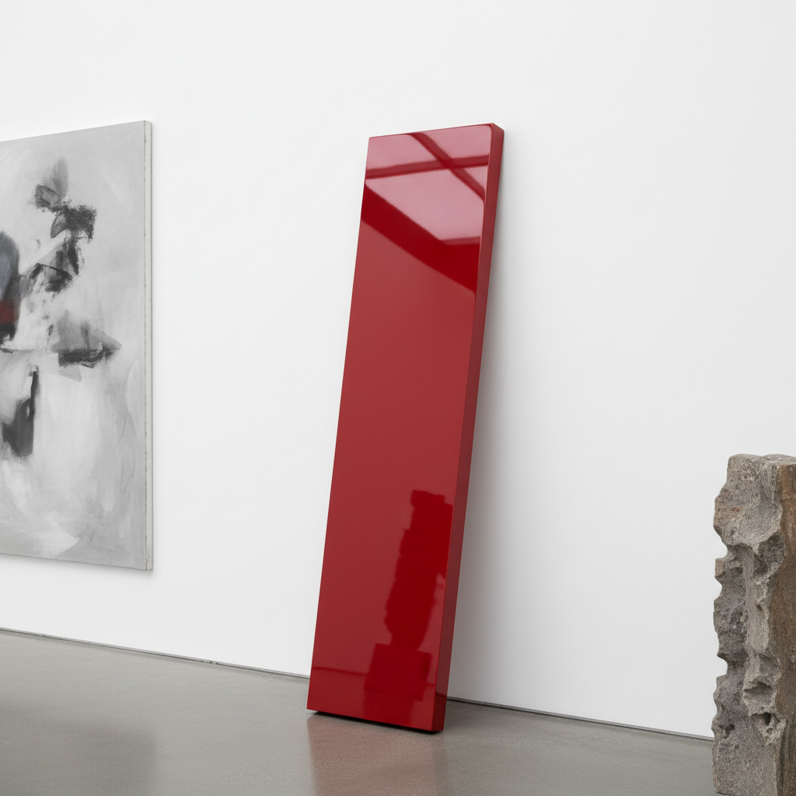

# John McCracken 约翰·麦克拉肯

> **时期：** 1934–2011  
> **关键词：** 彩色木板、极简主义雕塑、加州光与空间、倚靠的平板

## 概述

John McCracken 是美国雕塑家，以标志性的彩色木板（plank）闻名——高度抛光的单色木板斜倚在墙壁上，介于绘画和雕塑之间。这些作品以汽车漆般的光泽表面和饱和的单色（红、蓝、黑）创造出既是物体又是色彩体验的存在，如同从另一个维度滑入我们空间的神秘物体。

## 风格特征

- **倚靠姿态**：木板斜倚墙壁，同时接触地面和墙面，连接两个平面
- **高度抛光**：汽车漆般的镜面光泽，反射周围环境
- **饱和单色**：深红、钴蓝、纯黑等高度饱和的单一色彩
- **介于绘画与雕塑**：既有绘画的色彩平面性，又有雕塑的物理存在
- **神秘感**：作品如同《2001太空漫游》中的黑色方碑，具有超自然气质

## 代表作品

- *Red Plank*（1967）
- *Blue Column*（1968）
- *Think Pink*（1967）
- *Infinite*（2008，黑色不锈钢）

## 历史意义

McCracken 创造了一种全新的艺术物体类型——既不是传统雕塑也不是绘画，而是纯粹的色彩和物质存在。他的作品连接了极简主义的严谨和加州"光与空间"运动的感性，影响了后来的"特定物体"（Specific Objects）讨论。

## 概念图

