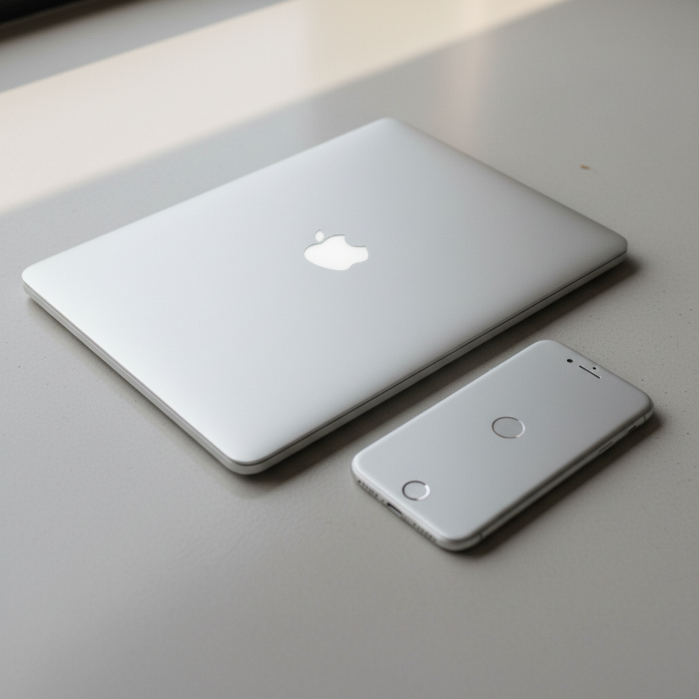

# Jonathan Ive 乔纳森·艾维

> **时期：** 1967–至今  
> **关键词：** 苹果设计、一体成型、触觉极简、铝合金美学

## 概述

Jonathan Ive 是英国工业设计师，苹果公司前首席设计官。他将Dieter Rams的功能主义理念与数字时代的触觉体验结合——iMac的半透明塑料、iPod的白色极简、iPhone的玻璃与金属一体化——定义了21世纪消费电子产品的视觉语言。

## 风格特征

- **一体成型**：整块铝合金CNC加工，消除接缝
- **触觉优先**：材料的手感和重量被精心设计
- **圆角与曲面**：柔和的圆角取代锐利的边缘
- **材料诚实**：铝就是铝、玻璃就是玻璃
- **减法设计**：不断去除直到无法再减

## 代表作品

- *iMac G3*（1998）
- *iPod*（2001）
- *iPhone*（2007）
- *Apple Park*（2017）

## 概念图

