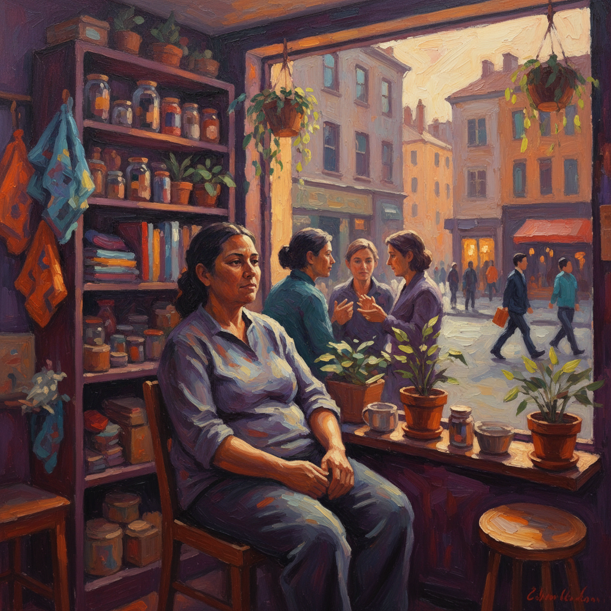

# Jordan Casteel 乔丹·卡斯蒂尔

> **时期：** 1989–至今  
> **关键词：** 社区肖像、大尺幅写实、哈莱姆日常、当代黑人生活

## 概述

Jordan Casteel 是美国当代肖像画家，以描绘哈莱姆社区日常人物的大尺幅油画著称。她的作品捕捉街头小贩、理发师、邻居和陌生人，用温暖的色彩和亲密的视角赋予普通人纪念碑式的尊严。

## 风格特征

- **大尺幅肖像**：通常超过两米，将日常人物提升至英雄叙事的尺度
- **温暖色调**：偏爱深紫、暖橙、翠绿，营造亲切而庄重的氛围
- **环境叙事**：人物始终处于其生活场景中——商店、街角、公园长椅
- **照片基础**：基于街头摄影，保留快照的即时感和自然姿态
- **笔触松弛**：在写实基础上保持绘画性，背景常以大面积色块处理

## 代表作品

- *Miles and Jojo*（2015）
- *Subway Hands*（2016）
- *Kevin the Kiteman*（2016）
- *Within Reach*（2020，纽约时代广场公共艺术）

## 历史意义

Casteel 延续了 Alice Neel 和 Kerry James Marshall 的肖像传统，将当代黑人社区的日常生活转化为美术馆级别的视觉档案，挑战了谁值得被画、被看见的权力结构。

## 概念图

