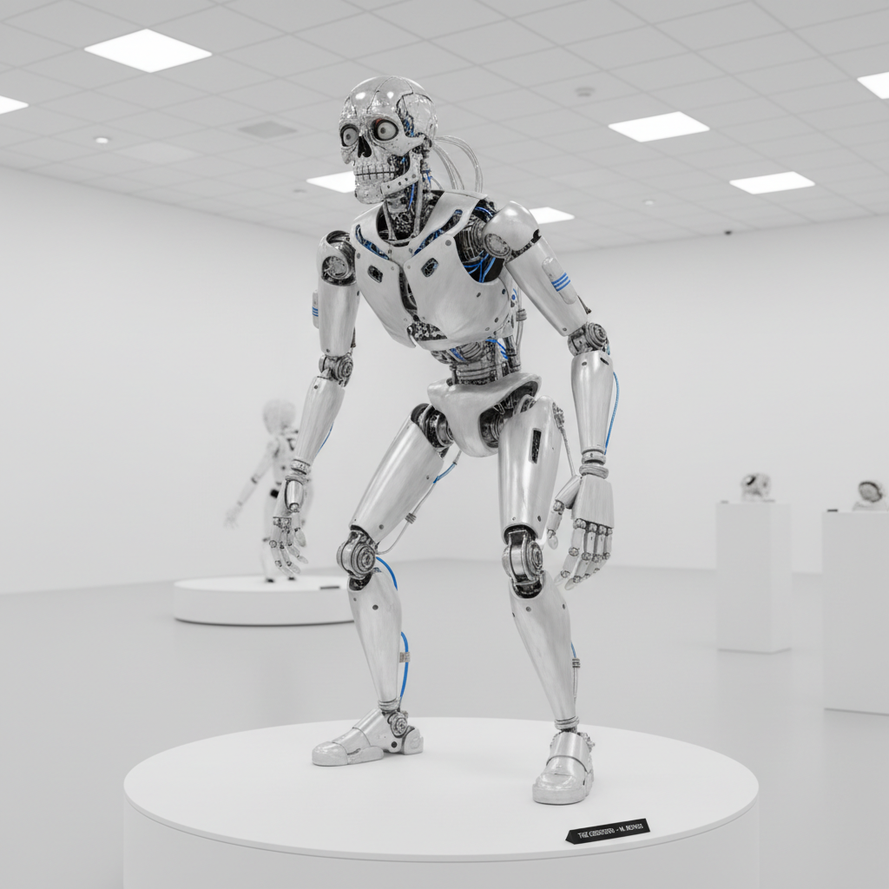

# Jordan Wolfson 乔丹·沃尔夫森

> **时期：** 1980–至今  
> **关键词：** 机器人雕塑、不适感、暴力与诱惑、面部追踪

## 概述

Jordan Wolfson 是美国艺术家，以制造令人不安的机械人偶和动画闻名。他的作品故意制造不适——一个会跟踪观众目光的机器人舞者、一个被铁链拖拽的男孩人偶——在诱惑和厌恶之间创造出无法回避的观看体验。

## 风格特征

- **机器人雕塑**：高度逼真的机械人偶具有自主动作
- **面部追踪**：作品能识别并跟踪观众的目光
- **不适美学**：故意制造心理不适和道德困境
- **暴力与魅力**：暴力行为与流行文化的诱惑并存
- **技术精密**：工业级机器人技术服务于艺术表达

## 代表作品

- *(Female figure)*（2014）
- *(Male figure)*（2014）
- *Colored sculpture*（2016）
- *ARTISTS FRIENDS RACISTS*（2020）

## 概念图

