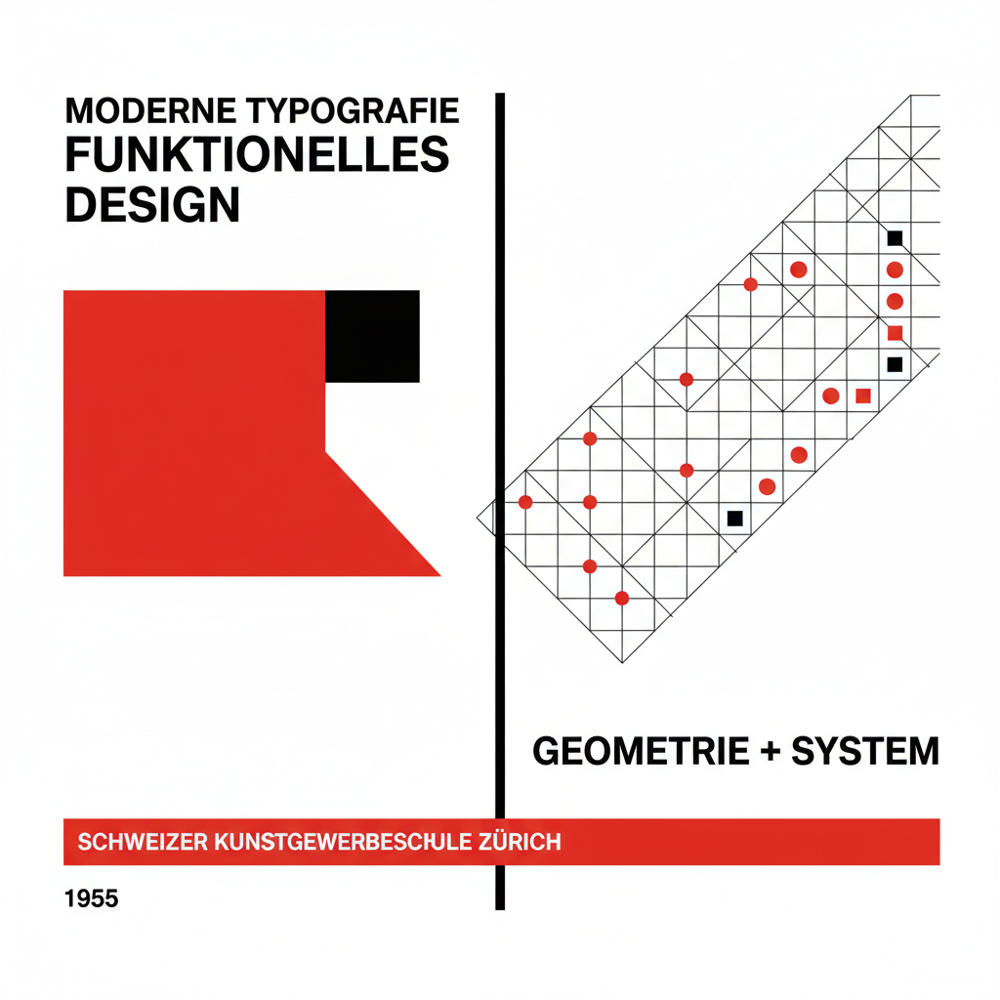

# Josef Müller-Brockmann 约瑟夫·米勒-布罗克曼

> **时期：** 1914–1996  
> **关键词：** 瑞士国际风格、网格系统、音乐海报、客观设计

## 概述

Josef Müller-Brockmann 是瑞士平面设计师，国际主义风格（Swiss Style）的奠基人之一。他的音乐会海报——用纯粹的几何形状和严格的网格表达音乐的节奏和结构——成为现代平面设计教育的经典范本。

## 风格特征

- **网格系统**：数学化的网格是一切设计的基础
- **无衬线字体**：Akzidenz-Grotesk和Helvetica
- **几何抽象**：用圆弧、直线和色块表达抽象概念
- **客观性**：设计师的个人风格应该消失
- **留白**：大面积空白作为积极的设计元素

## 代表作品

- *Musica Viva 音乐会海报*系列
- *Zurich Tonhalle 海报*系列
- *Grid Systems in Graphic Design*（1981，著作）
- *瑞士汽车俱乐部安全海报*

## 概念图

