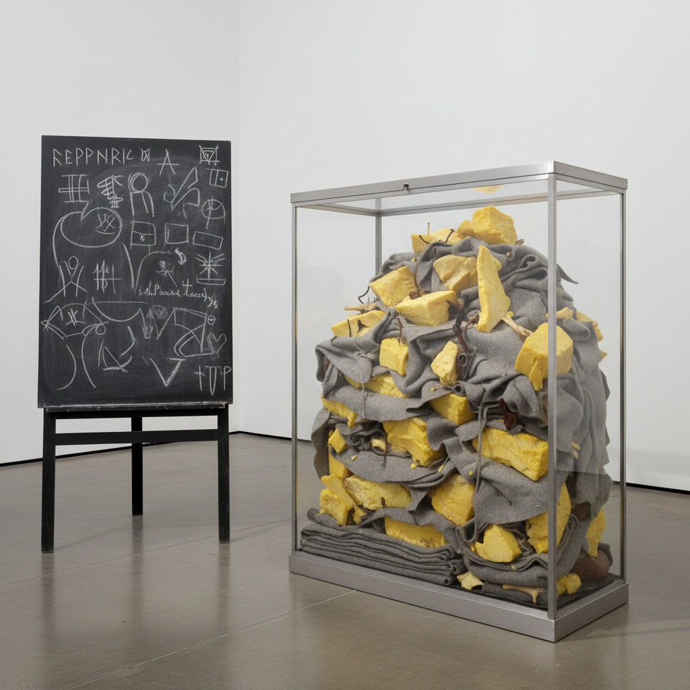

# Joseph Beuys 约瑟夫·博伊斯

> **流派**: 激浪派 · 行为艺术 · 社会雕塑  
> **时期**: 1921–1986 德国  
> **关键词**: 毛毡与油脂、社会雕塑、人人都是艺术家、萨满主义

## 概述

约瑟夫·博伊斯是20世纪最具影响力也最具争议性的艺术家之一。他将艺术扩展为"社会雕塑"——认为每个人的创造性思维都是塑造社会的艺术行为。他用毛毡、油脂、蜂蜡等非传统材料创作，将个人神话与政治行动融为一体。

## 视觉特征

- **毛毡与油脂**: 标志性材料，象征温暖、能量和治愈
- **黑板书写**: 行为表演中的粉笔图表和文字
- **维特林展柜**: 玻璃柜中陈列的神秘物品组合
- **灰色调**: 毛毡的灰色、油脂的黄色构成基本色调
- **仪式感**: 作品常具有萨满仪式般的神秘氛围

## 代表作品

- 《如何向一只死兔子解释绘画》(1965)
- 《7000棵橡树》(1982)
- 《油脂椅》(1964)
- 《我爱美国，美国爱我》(1974)

## 历史影响

博伊斯彻底扩展了"艺术"的定义——从物体到行动，从美学到政治，从个人到社会。他的"社会雕塑"概念影响了后来的社区艺术、参与式艺术和社会实践艺术。

## 相关风格

- [Fluxus 激浪派](fluxus.md)
- [Anselm Kiefer 安塞尔姆·基弗](anselm-kiefer.md)
- [Marina Abramović 玛丽娜·阿布拉莫维奇](marina-abramovic.md)
