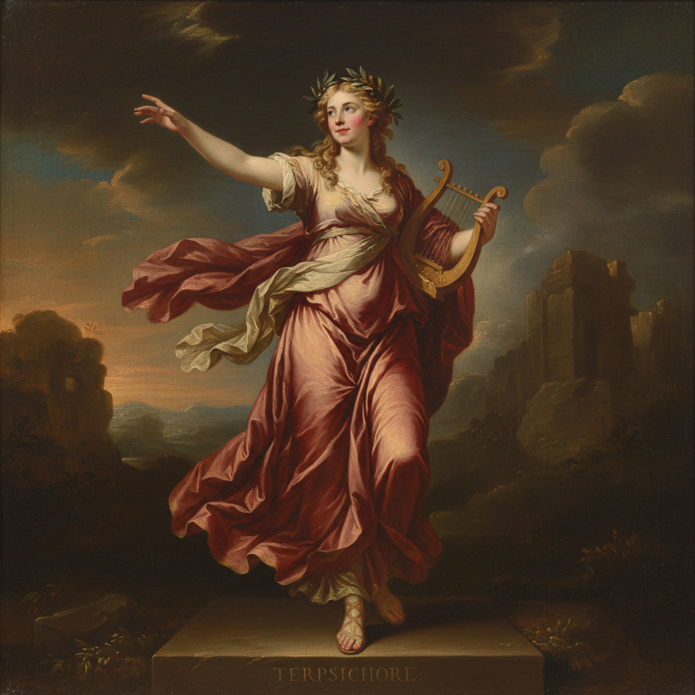

# Joshua Reynolds 约书亚·雷诺兹

> "A mere copier of nature can never produce anything great." — Joshua Reynolds

## 概述

约书亚·雷诺兹爵士（Sir Joshua Reynolds，1723–1792）是英国皇家艺术学院首任院长，18世纪英国肖像画的最高代表。他以"宏大风格"（Grand Manner）肖像闻名——将普通人物置于古典神话或历史的语境中，用戏剧性的姿态和丰富的色彩赋予肖像画以史诗般的尊严。

## 核心特征

| 特征 | 描述 |
|------|------|
| 宏大风格 | 肖像画的古典化提升 |
| 神话化 | 将模特置于神话角色中 |
| 戏剧姿态 | 古典雕塑般的优雅姿势 |
| 丰富色彩 | 威尼斯画派的温暖调性 |
| 社交肖像 | 贵族和名流的理想化 |
| 学院理论 | 《论艺术》的系统美学 |

## 代表作品

| 作品 | 年代 | 意义 |
|------|------|------|
| *Mrs Siddons as the Tragic Muse* | 1783–84 | 宏大风格肖像的巅峰 |
| *The Age of Innocence* | 1788 | 童真的永恒形象 |
| *Three Ladies Adorning a Term of Hymen* | 1773 | 群像的古典优雅 |
| *Self-Portrait* | 1780 | 艺术家的学者形象 |

## AI生成概念图

## 与其他风格的关系

- **Grand Manner** → 宏大风格的定义者
- **Gainsborough** → 同代竞争对手
- **Royal Academy** → 英国皇家艺术学院创始人
- **Titian/Rubens** → 继承威尼斯和巴洛克传统
