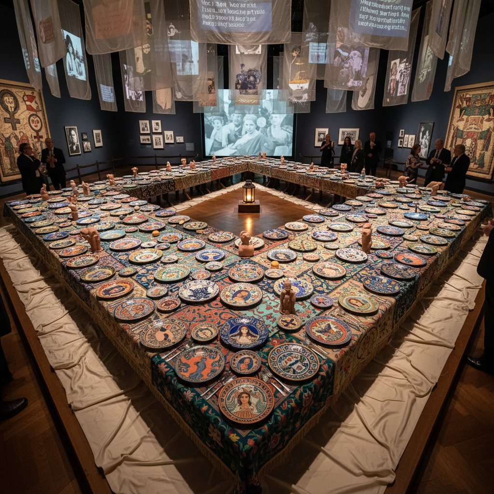

# Judy Chicago 朱迪·芝加哥

> **时期：** 1939–至今  
> **关键词：** 女性主义艺术先驱、晚宴、合作创作、被压制的女性历史

## 概述

Judy Chicago 是美国艺术家和女性主义艺术运动的创始人之一，以大型合作装置作品《晚宴》（The Dinner Party）闻名——一件为39位历史上重要女性设置的三角形宴会桌，每个位置都有独特的瓷盘和刺绣桌布。她致力于将被艺术史排斥的女性经验和"女性工艺"（陶瓷、刺绣、编织）提升为严肃的艺术形式。

## 风格特征

- **合作创作**：大型项目由数百名志愿者共同完成
- **女性工艺的提升**：陶瓷、刺绣、编织等传统女性技艺被赋予纪念碑性
- **中心核心意象**：标志性的花朵/蝴蝶形态暗示女性身体
- **历史研究**：每件作品背后都有深入的历史和文化研究
- **色彩的精神性**：从极简主义的喷涂色彩到晚期的烟火和玻璃

## 代表作品

- *The Dinner Party*（1974–1979）
- *The Birth Project*（1980–1985）
- *Holocaust Project: From Darkness into Light*（1985–1993）
- *Womanhouse*（1972，合作）

## 历史意义

Chicago 是女性主义艺术运动最重要的创始人之一。《晚宴》是20世纪最具影响力的艺术作品之一，它将被遗忘的女性历史视觉化，并证明了合作创作和"低级"工艺可以产生伟大的艺术。

## 概念图

