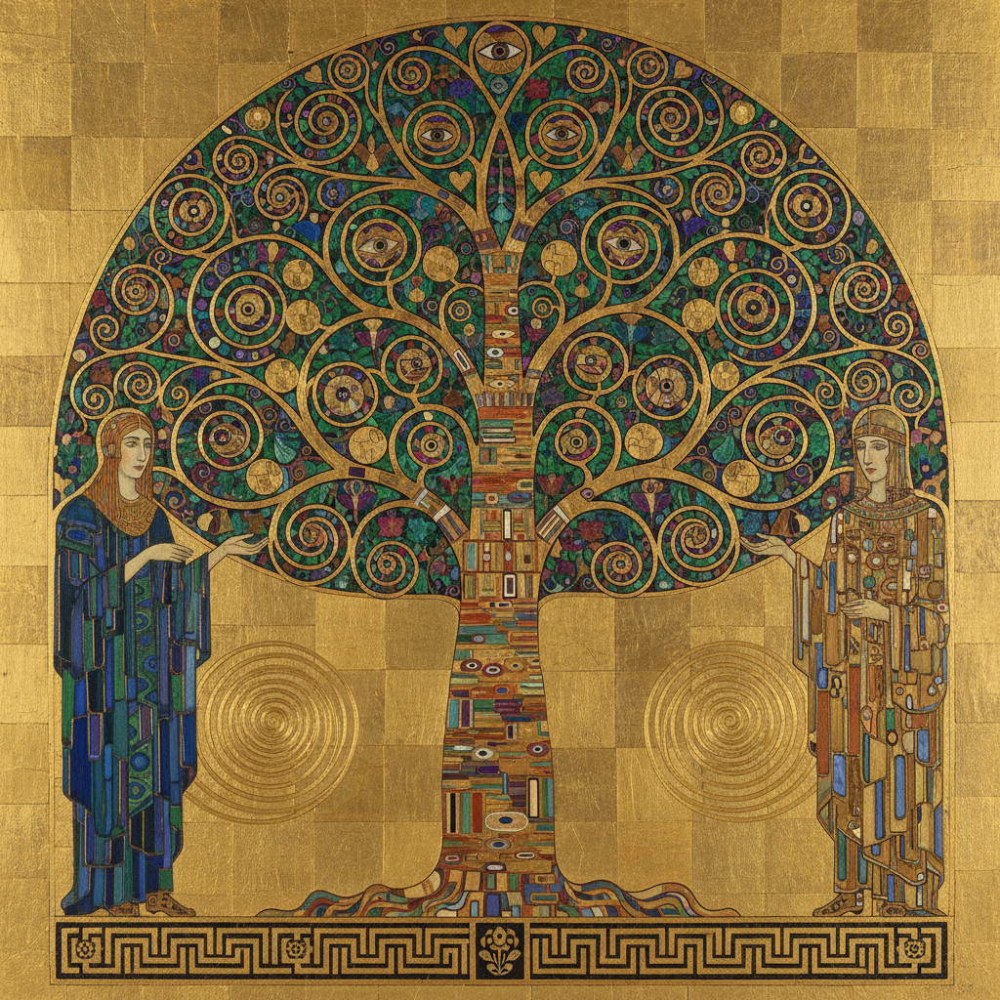

# Jugendstil Painting 青年风格绘画

> **时期：** 1896年–1910年代  
> **关键词：** 德国新艺术、有机装饰、自然主义、慕尼黑分离派、总体艺术

## 概述

Jugendstil（青年风格）是新艺术运动在德语区的本土化表达——得名于1896年慕尼黑创刊的《青年》杂志。与法国Art Nouveau的柔美曲线相比，Jugendstil更注重几何化的自然形态和更为克制的装饰语言。古斯塔夫·克里姆特的金色世界、科洛曼·莫泽的几何图案——Jugendstil在有机与几何之间找到了独特的平衡。

## 风格特征

- **几何化自然**：将花卉和植物简化为几何图案
- **线条韵律**：流畅但更为克制的曲线
- **平面装饰**：强调二维表面的图案美
- **金色运用**：大量金箔和金色颜料
- **总体设计**：从建筑到家具到绘画的统一

## 代表人物与作品

- 古斯塔夫·克里姆特 金色时期
- 科洛曼·莫泽 装饰设计
- 弗朗茨·冯·施图克 象征主义
- 海因里希·沃格勒 沃尔普斯韦德

## 概念图

