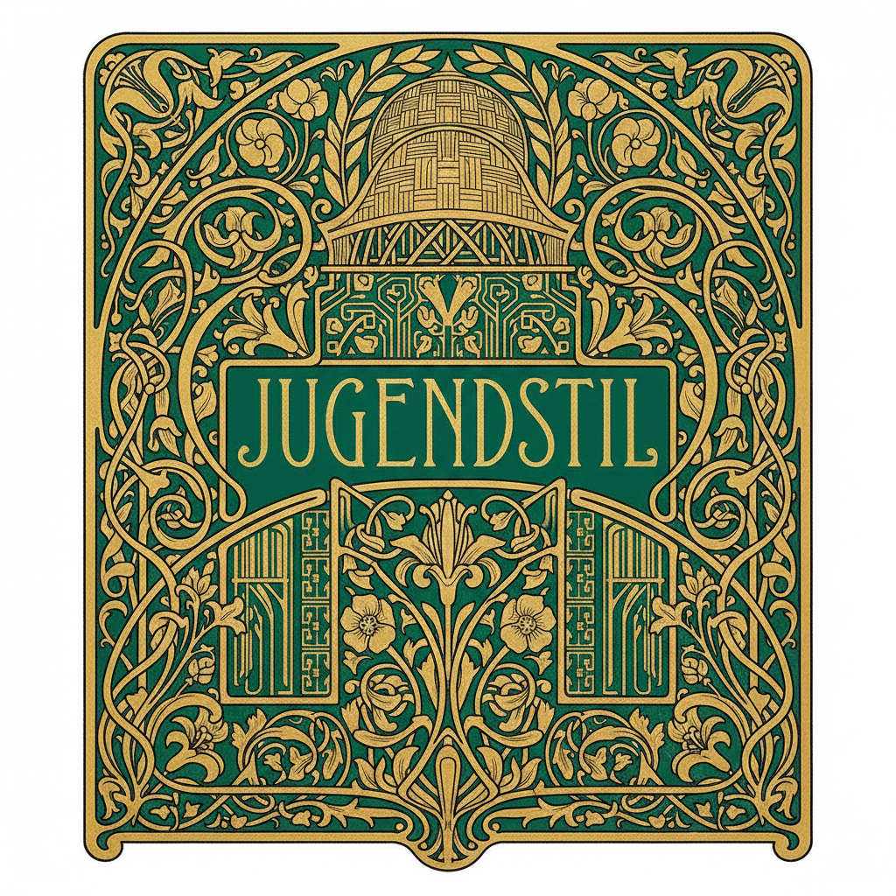

# Jugendstil 青年风格



> **"青春的线条——当德语世界用花卉与几何重新定义'新'。"**

## 概述

Jugendstil（德语"青年风格"）是Art Nouveau在德语世界的本土化表达，得名于1896年慕尼黑创刊的杂志《Die Jugend》（青年）。它与法国/比利时的新艺术运动同源，但发展出更强的几何抽象倾向，尤其在后期阶段。

## 时代背景

| 维度 | 内容 |
|------|------|
| 时间 | 1895–1914 |
| 地点 | 德国（慕尼黑、达姆施塔特、柏林、魏玛）、奥地利（维也纳） |
| 命名来源 | 慕尼黑杂志《Die Jugend》（1896年创刊） |
| 文化语境 | 工业化时代对手工艺与自然的回归渴望 |

## 与 Art Nouveau 的区别

| 维度 | Art Nouveau（法/比） | Jugendstil（德/奥） |
|------|------|------|
| 线条 | 流动的鞭形曲线 | 从曲线逐渐走向几何化 |
| 装饰 | 有机植物形态为主 | 植物+几何图案并重 |
| 后期发展 | 保持装饰性 | 趋向简化与抽象 |
| 哲学 | 美化生活 | 艺术与生活的统一（Gesamtkunstwerk） |

## 视觉特征

### 早期（1895–1900）：花卉阶段
- 流动的植物线条（百合、藤蔓、睡莲）
- 受日本浮世绘影响的平面化构图
- 鞭形曲线（Peitschenhieb）

### 后期（1900–1914）：几何阶段
- 简化的几何形态
- 方形与直线的强调
- 黑白对比的运用
- 趋向抽象的装饰图案

## 地域变体

| 地区 | 名称 | 特点 |
|------|------|------|
| 德国慕尼黑 | Jugendstil | 杂志文化驱动，插画为核心 |
| 奥地利维也纳 | Sezessionstil | 更几何化，Klimt的金箔美学 |
| 德国达姆施塔特 | Mathildenhöhe艺术家殖民地 | 建筑与工艺的整体设计 |
| 德国柏林/魏玛 | 走向抽象 | Henry van de Velde的影响 |

## 代表人物

| 人物 | 领域 | 代表作 |
|------|------|------|
| Gustav Klimt | 绘画 | 《吻》、贝多芬饰带 |
| Joseph Maria Olbrich | 建筑 | 维也纳分离派展览馆（1898） |
| Josef Hoffmann | 建筑/设计 | 斯托克莱特宫（布鲁塞尔） |
| Koloman Moser | 平面/工艺 | 维也纳工坊（Wiener Werkstätte） |
| Peter Behrens | 建筑/设计 | 从Jugendstil走向现代主义 |
| Henry van de Velde | 建筑/设计 | 抽象线条的先驱 |
| Otto Wagner | 建筑 | 维也纳邮政储蓄银行 |

## 与其他风格的关系

```
英国工艺美术运动 → Art Nouveau(法/比)
        ↓                    ↓
日本浮世绘 ──→ Jugendstil(德/奥) → 维也纳分离派
                      ↓                    ↓
              达姆施塔特艺术家殖民地    维也纳工坊
                      ↓                    ↓
              德意志制造联盟(1907) → 包豪斯(1919)
```

## 多语言名称

| 语言 | 名称 |
|------|------|
| 德语 | Jugendstil |
| 奥地利 | Sezessionstil / Wiener Jugendstil |
| 匈牙利 | Szecesszió |
| 捷克 | Secese |
| 意大利 | Stile Liberty / Stile Floreale |
| 西班牙 | Modernismo |
| 英语 | Art Nouveau / Modern Style |
| 日语 | ユーゲントシュティール |
| 韩语 | 유겐트슈틸 |

## 当代影响

- 维也纳城市品牌与旅游视觉
- Klimt风格在当代插画和时尚中的持续引用
- 几何化Jugendstil对现代极简设计的启发
- 字体设计中的Jugendstil复兴

## 延伸阅读

- Klaus-Jürgen Sembach《Art Nouveau: Utopia – Reconciling the Irreconcilable》
- 维也纳分离派展览馆（Secession Building）常设展
- 达姆施塔特 Mathildenhöhe 联合国教科文组织世界遗产

---

*最后更新：2026-07-26*
