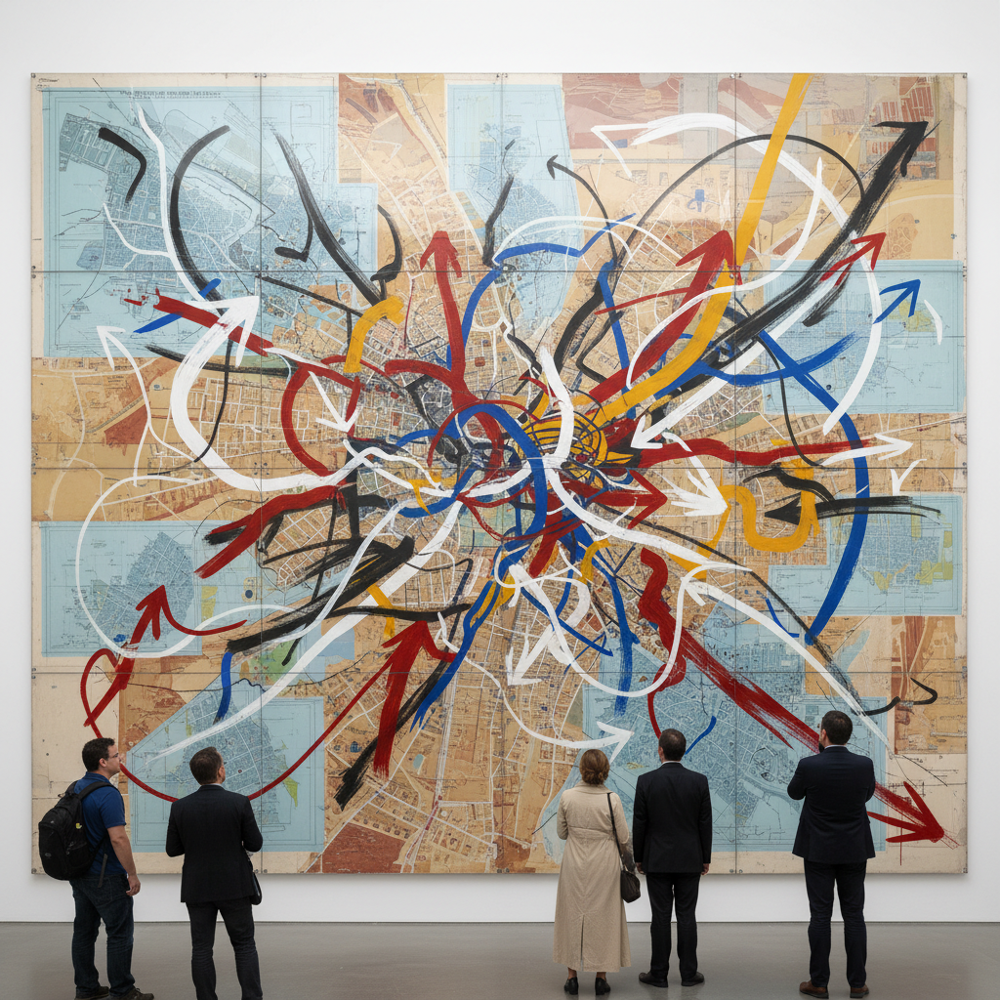

# Julie Mehretu 朱莉·梅赫雷图

> **流派**: 当代绘画 · 抽象艺术  
> **时期**: 1970–至今 埃塞俄比亚/美国  
> **关键词**: 建筑图层、地图叠加、城市爆炸、史诗抽象

## 概述

朱莉·梅赫雷图创作巨幅抽象画，将建筑蓝图、城市地图、气象图和历史事件的痕迹叠加在多层透明画面上。她的作品看起来像是城市在爆炸或形成的瞬间——无数线条、箭头和色块在画面上高速运动，创造出一种关于全球化、移民和政治动荡的视觉史诗。

## 视觉特征

- **多层叠加**: 数十层透明介质上的线条互相渗透
- **建筑碎片**: 可辨认的建筑平面图和城市网格
- **动态线条**: 箭头、弧线、飞溅的墨点暗示运动
- **巨大尺幅**: 作品常超过3×5米
- **从精确到混沌**: 底层精确的制图逐渐被上层的狂暴笔触覆盖

## 代表作品

- 《Mogamma》(2012) — 以开罗解放广场为灵感
- 《Stadia》系列 (2004)
- 旧金山SFMOMA壁画 (2017)
- 《Conjured Parts》系列 (2016–)

## 历史影响

梅赫雷图证明了抽象绑画在21世纪仍然可以具有政治力量和历史深度。她将制图学、建筑学和绘画融为一体，创造了一种全新的"信息抽象"语言。

## 相关风格

- [Abstract Expressionism 抽象表现主义](abstract-expressionism.md)
- [Cy Twombly 赛·托姆布雷](cy-twombly.md)
- [Contemporary Painting 当代绘画](contemporary-painting.md)
