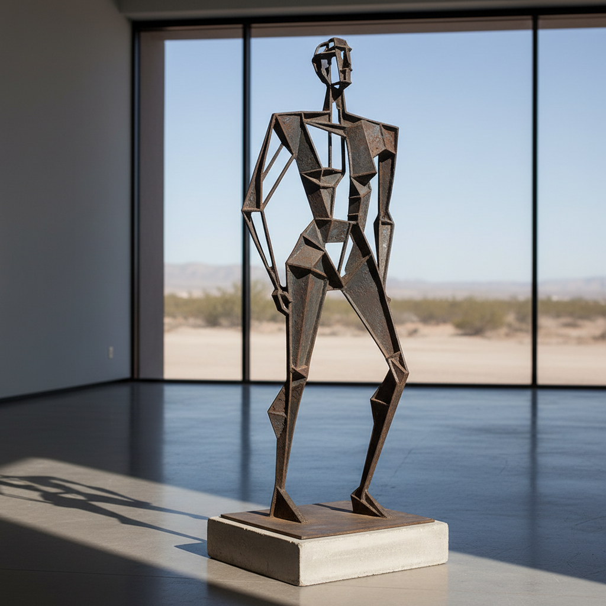

# Julio González 胡利奥·冈萨雷斯

> **时期：** 1876–1942  
> **关键词：** 铁雕塑之父、焊接技术、空间绘画、西班牙现代主义

## 概述

Julio González 是西班牙雕塑家，被称为"铁雕塑之父"，是第一位系统性地将工业焊接和锻造技术应用于艺术雕塑的现代艺术家。他与毕加索的合作将立体主义从绘画延伸到三维空间，用铁条和铁片在空气中"绘画"，创造出开放的、透明的雕塑形态。

## 风格特征

- **铁的焊接与锻造**：将铁匠技艺提升为艺术创作方法
- **空间中的绘画**：用铁条在空间中勾勒线条，如同三维素描
- **开放形态**：雕塑不再是封闭的体量，而是开放的线性结构
- **人物变形**：将人体简化为几何化的铁质骨架
- **材料的诚实**：铁的锈蚀、焊痕和锻打痕迹被保留为表面质感

## 代表作品

- *Montserrat*（1937）
- *Woman Combing Her Hair*（1936）
- *Cactus Man*（1939-1940）
- *Head Called "The Tunnel"*（1933-1934）

## 历史意义

González 开创了焊接金属雕塑的传统，直接影响了David Smith、Anthony Caro和Richard Serra。他证明了工业材料和技术可以创造出与大理石和青铜同样深刻的艺术表达。

## 概念图

