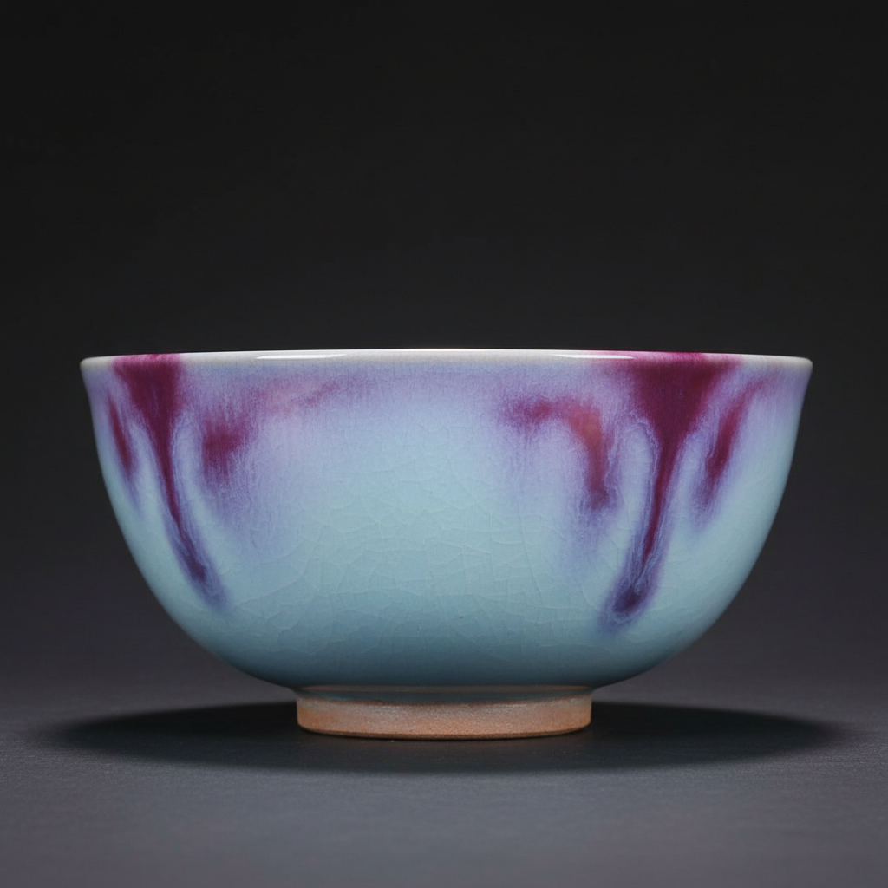

# Jun Ware Art 钧窑艺术

> "Jun ware is the sky captured in glaze — opalescent blue suffused with purple, the result of copper and iron suspended in a thick glaze that scatters light like clouds at sunset, each piece unique because the kiln's atmosphere paints what no human hand can plan, the Chinese ideal of controlled accident elevated to its highest expression, where the potter prepares and the fire decides." — Unknown

## 概述

钧窑艺术（Jun Ware Art）是中国宋代五大名窑之一，以其变幻莫测的窑变釉色著称于世。钧窑位于今河南省禹州市，其最大特色是在天蓝色乳光釉的基础上，通过铜元素在还原气氛中的作用，产生紫红色的窑变效果——"入窑一色，出窑万彩"是对钧窑窑变最经典的描述。钧窑的釉色如同天空和晚霞的变幻，每一件作品都是独一无二的。

钧窑艺术的核心要素包括：1）窑变釉色——不可预测的色彩变化；2）乳光效果——釉层的乳光散射；3）天蓝基调——天蓝色的基本色调；4）紫红窑变——铜红的紫红色变化；5）厚釉质感——厚实的釉层质感；6）蚯蚓走泥纹——独特的釉面纹理；7）宋代审美——宋代含蓄的审美理想。

## 核心特征

| 特征 | 描述 |
|------|------|
| 窑变釉色 | 不可预测的色彩 |
| 乳光效果 | 釉层乳光散射 |
| 天蓝基调 | 天蓝色基本色调 |
| 紫红窑变 | 铜红紫红变化 |
| 厚釉质感 | 厚实的釉层 |
| 蚯蚓走泥纹 | 独特釉面纹理 |

## 视觉特征

- **天蓝色**：如天空般的蓝色基调
- **紫红斑**：紫红色的窑变斑块
- **乳光感**：如乳汁般的光泽
- **色彩流动**：色彩的自然流动
- **厚釉质感**：厚实温润的釉面
- **蚯蚓纹**：如蚯蚓爬过的纹理

## 代表作品

| 作品 | 艺术家/文化 | 年代 | 意义 |
|------|-------------|------|------|
| *钧窑玫瑰紫釉* | 宋代钧窑 | 北宋 | 窑变釉的经典 |
| *钧窑天蓝釉* | 宋代钧窑 | 北宋 | 天蓝釉的代表 |
| *钧窑花盆* | 宋代钧窑 | 北宋 | 官钧花器 |
| *钧窑出戟尊* | 宋代钧窑 | 北宋 | 经典器形 |
| *当代钧瓷* | 当代钧瓷艺人 | 当代 | 钧瓷的当代传承 |

## 历史时间线

| 时期 | 事件 |
|------|------|
| 唐代 | 钧窑的萌芽（花釉瓷） |
| 北宋 | 钧窑的鼎盛 |
| 金元 | 钧窑的延续和扩散 |
| 明清 | 仿钧和钧窑系的发展 |
| 当代 | 禹州钧瓷的复兴 |

## 中国语境

钧窑是中国陶瓷美学中"天人合一"理念的最佳体现。钧窑的窑变釉色不是人为设计的结果，而是窑火自然造就的——陶工准备好一切条件，最终的色彩由窑火决定。这种"人事尽而听天命"的创作方式完美体现了中国哲学中人与自然和谐共处的理想。钧窑在宋代五大名窑中以其色彩的丰富变化独树一帜——汝窑以天青著称，官窑以开片著称，哥窑以金丝铁线著称，定窑以白瓷著称，而钧窑则以窑变的万千色彩著称。"钧瓷无对，窑变无双"——每一件钧瓷都是独一无二的，这使得钧瓷在中国陶瓷收藏中具有特殊的地位。当代禹州的钧瓷产业正在复兴——当代钧瓷艺人在传统基础上不断创新，使这一千年传统焕发新的生命力。

## AI生成概念图

## 与其他风格的关系

- **Song Dynasty Kilns** → 宋代名窑
- **Transmutation Glaze** → 窑变釉
- **Opalescent Glaze** → 乳光釉
- **Copper Red** → 铜红釉
- **Flambé** → 窑变
- **Chinese Aesthetics** → 中国美学

---

*浮光艺志 | Chronicle of Artistry*
