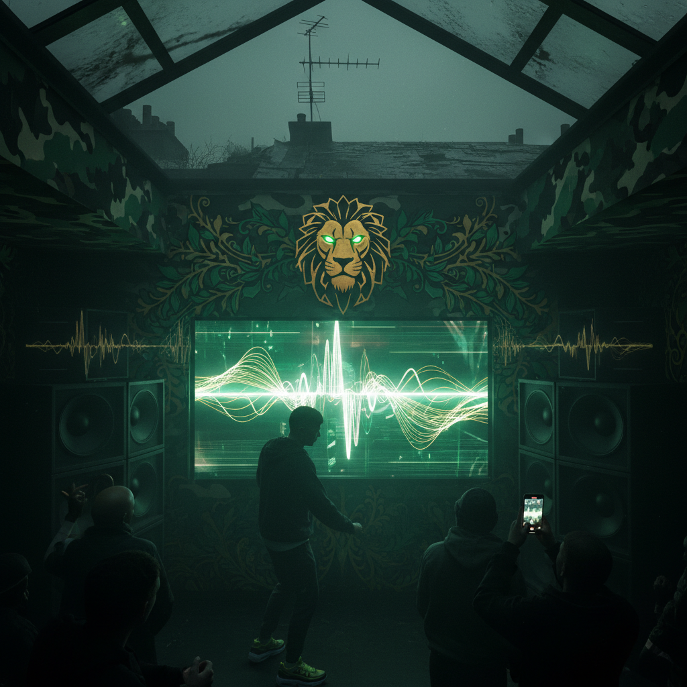

# Jungle / Drum & Bass 丛林/鼓打贝斯



> **"碎拍鼓点、深沉贝斯、盗版电台——伦敦地下的声音革命。"**

## 概述

| 维度 | 描述 |
|------|------|
| 时期 | 1991–至今 |
| 别名 | Jungle, Drum and Bass, DnB, Drum & Bass |
| 核心色彩 | 深绿、金色、黑色、迷彩、橙色 |
| 关键元素 | 碎拍(Breakbeat)、深沉贝斯、MC、盗版电台 |
| 代表人物 | Goldie, LTJ Bukem, Roni Size, Andy C |
| 关联风格 | Rave, Breakbeat, Dubstep, Grime, UK Garage |

---

## 历史脉络

| 年份 | 事件 |
|------|------|
| 1991 | Jungle 从 Hardcore Rave 中分化 |
| 1993 | "Jungle"正式命名——伦敦地下场景 |
| 1995 | Goldie "Timeless"——Jungle 进入主流 |
| 1997 | Roni Size "New Forms"——Mercury Prize |
| 2000s | Drum & Bass 全球化——Hospital Records |
| 2010s | 继续演变——Liquid DnB, Neurofunk |

### 核心哲学

Jungle/DnB 的精神是**"速度+深度——170BPM的鼓点下面是无底的贝斯"**：
- 速度 = 能量（"170BPM 是完美的心跳"）
- 贝斯 = 物理（"你不是听到贝斯——你感受到它"）
- MC = 社区（"MC 是舞池和 DJ 之间的桥梁"）
- 地下 = 真实（"盗版电台 > BBC"）
- "如果你的音箱没有震动——贝斯还不够大"

---

## 视觉语法

### 色彩系统

```
主色：
  深绿 (#006400) — 丛林、迷彩
  金色 (#DAA520) — Metalheadz 标志
  黑色 (#000000) — 夜晚、地下

辅色：
  橙色 (#FF8C00) — 能量
  银色 (#C0C0C0) — 金属、未来
  迷彩 — 军事元素

规则：
  - 暗色调为主
  - 金属/工业质感
  - 速度感（运动模糊）
  - 有机+机械的混合

质感：
  金属 — 工业、机械
  迷彩 — 军事、丛林
  混凝土 — 地下、城市
  液态 — 贝斯的视觉化
```

### 标志性元素

| 类别 | 元素 |
|------|------|
| 音乐 | 碎拍(Amen Break)、Sub Bass、MC |
| 服装 | 迷彩、运动服、帽衫、Nike Air Max |
| 媒介 | 盗版电台、黑胶/白标、Rinse FM |
| 厂牌 | Metalheadz、Moving Shadow、Hospital |
| 场所 | 伦敦地下俱乐部、仓库 |
| 态度 | 地下、速度、贝斯、社区、伦敦 |

---

## 与千禧怀旧的关系

### 英国电子音乐的核心
- Jungle/DnB = 英国对电子音乐最独特的贡献
- 从 Jungle → DnB → Dubstep → Grime 的演变链
- "Amen Break 是人类历史上被采样最多的鼓点"
- 影响了全球的电子音乐制作

### 与 UK 街头文化的交叉
- Nike Air Max = DnB 的"官方球鞋"
- 迷彩 = Jungle 的视觉符号
- 盗版电台 = 伦敦地下文化的声音
- "DnB 是伦敦的声音——就像 Hip-Hop 是纽约的声音"

---

## 中国语境

- DnB 在中国电子音乐场景中的存在
- 中国 Bass Music 社区
- 与中国"地下电子"文化的交叉
- 深圳/上海的 DnB 夜场

---

## 设计应用

| 场景 | 应用方式 |
|------|----------|
| 音乐 | 碎拍+贝斯+海报+厂牌视觉 |
| 品牌 | 速度+地下+能量+城市+夜晚 |
| 时尚 | 迷彩+运动+Nike+帽衫+街头 |
| 数字 | 运动模糊+金属+液态+速度感 |

---

## 相关风格

← [Acid House 酸浩室](acid-house.md) | [Trip-Hop 神游舞曲](trip-hop.md) →

↑ [返回千禧怀旧目录](README.md) | [返回总目录](../README.md)
