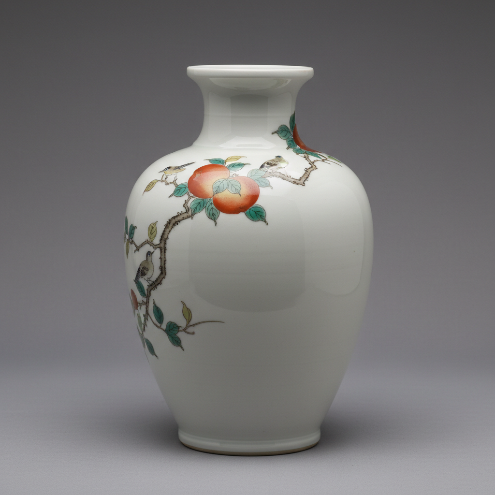

# Kakiemon Art 柿右卫门艺术

> "Kakiemon is silence made visible — sparse asymmetric compositions of flowers, birds, and figures painted in jewel-bright enamels on milk-white porcelain with vast areas of empty space, a Japanese aesthetic of restraint that captivated European collectors accustomed to horror vacui, proving that what is left unpainted can be as powerful as what is painted, elegance through omission." — Unknown

## 概述

柿右卫门艺术（Kakiemon Art）是日本17世纪在有田地区发展的一种精美的彩绘瓷器艺术，以酒井田柿右卫门家族的名字命名。柿右卫门瓷以其独特的"乳白色"（濁手/にごしで）胎体和疏朗的不对称构图著称——在大面积的乳白色留白上，以精细的红、蓝、绿、黄等彩料绘制花鸟、人物等图案。柿右卫门风格代表了日本美学中"余白"（留白）的精髓——与伊万里的华丽满工形成鲜明对比。

柿右卫门艺术的核心要素包括：1）乳白胎——独特的乳白色瓷胎；2）疏朗构图——大面积留白的构图；3）不对称——不对称的装饰布局；4）精细彩绘——精细的釉上彩绘；5）家族传承——柿右卫门家族的传承；6）欧洲影响——对欧洲陶瓷的深远影响；7）日本美学——体现日本美学精髓。

## 核心特征

| 特征 | 描述 |
|------|------|
| 乳白胎 | 独特乳白色瓷胎 |
| 疏朗构图 | 大面积留白构图 |
| 不对称 | 不对称装饰布局 |
| 精细彩绘 | 精细釉上彩绘 |
| 家族传承 | 柿右卫门家族传承 |
| 欧洲影响 | 对欧洲陶瓷深远影响 |

## 视觉特征

- **乳白底色**：温暖的乳白色底色
- **大面积留白**：大量的空白空间
- **不对称布局**：偏向一侧的构图
- **色彩精细**：精细的多色彩绘
- **花鸟题材**：花卉、鸟类、昆虫
- **优雅克制**：优雅克制的美感

## 代表作品

| 作品 | 艺术家/文化 | 年代 | 意义 |
|------|-------------|------|------|
| *柿右卫门色绘花鸟文瓶* | 有田 | 17世纪 | 经典柿右卫门 |
| *濁手花鸟文碗* | 有田 | 17世纪 | 乳白胎精品 |
| *色绘岩梅文大壶* | 有田 | 17世纪 | 大型器物 |
| *欧洲仿柿右卫门* | 迈森等 | 18世纪 | 欧洲仿制 |
| *当代柿右卫门* | 第15代 | 当代 | 当代传承 |

## 历史时间线

| 时期 | 事件 |
|------|------|
| 1640年代 | 柿右卫门风格的形成 |
| 1660-1690年 | 柿右卫门的黄金时代 |
| 18世纪 | 欧洲大量仿制 |
| 近代 | 柿右卫门家族的延续 |
| 当代 | 第15代柿右卫门（人间国宝） |

## 中国语境

柿右卫门瓷与中国陶瓷有深厚的渊源。日本瓷器技术本身源自中国（经朝鲜传入），但柿右卫门发展出了完全不同于中国的装饰美学。中国瓷器传统上倾向于满工装饰——无论是青花还是彩瓷，都追求画面的丰富和完整。而柿右卫门则体现了日本美学中"间"（ma）的概念——通过大面积的留白来突出装饰的精致。柿右卫门对欧洲陶瓷的影响甚至超过了中国瓷器——德国迈森、法国尚蒂伊、英国切尔西等欧洲名窑都大量模仿柿右卫门风格。柿右卫门的成功证明了东亚陶瓷文化圈内不同美学传统的独立价值——中国的丰富华丽和日本的简约留白各有其魅力。

## AI生成概念图

## 与其他风格的关系

- **Imari** → 伊万里
- **Arita Ware** → 有田烧
- **Meissen** → 迈森瓷器
- **Nabeshima** → 锅岛烧
- **Japanese Aesthetics** → 日本美学
- **Famille Verte** → 五彩

---

*浮光艺志 | Chronicle of Artistry*
