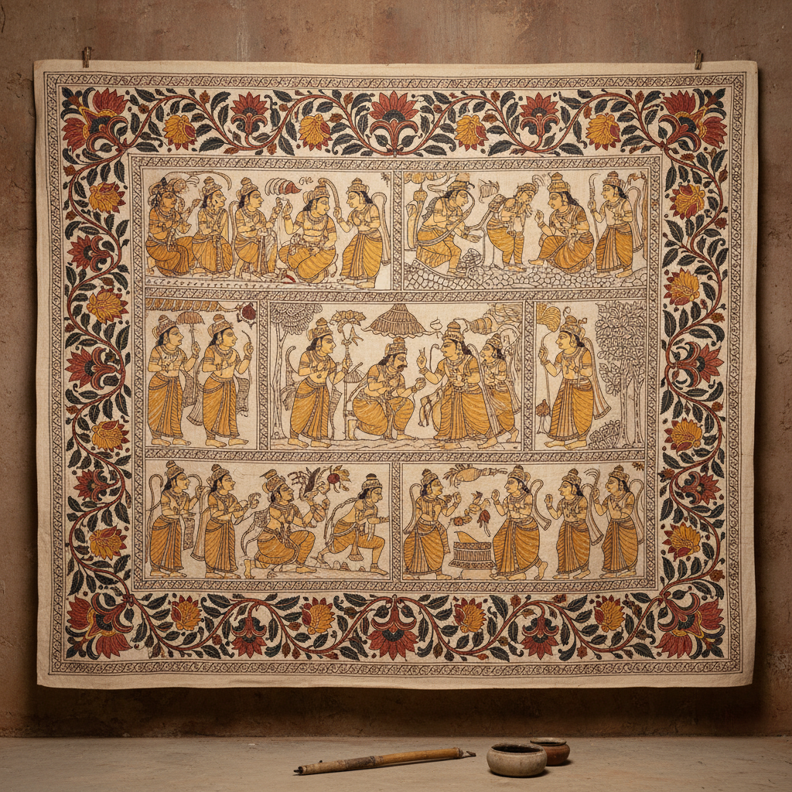

# Kalamkari 卡拉姆卡里 | కలంకారి

> **"笔尖蘸着铁锈和牛奶——安得拉邦的布上史诗。"**

## 概述

卡拉姆卡里（Kalamkari / కలంకారి）是印度安得拉邦（Andhra Pradesh）的传统手绘/印染纺织艺术，"Kalam"意为笔，"Kari"意为工艺。这种艺术使用竹笔蘸取天然染料在棉布上绘制精美的图案，主要描绘印度教史诗和花卉纹样。两大流派——斯里卡拉哈斯蒂（Srikalahasti，手绘）和马苏利帕特南（Machilipatnam，木版印刷）——代表了不同的技法传统。17世纪曾大量出口欧洲，深刻影响了欧洲的"印花棉布"（Chintz）时尚。

## 两大流派

| 流派 | 地点 | 技法 | 题材 |
|------|------|------|------|
| Srikalahasti | 安得拉邦 | 手绘（竹笔） | 印度教神话、史诗 |
| Machilipatnam | 安得拉邦 | 木版印刷 | 波斯花卉、几何 |

## 核心特征

- **天然染料**：铁锈水（黑）、明矾+茜草（红）、靛蓝（蓝）、石榴皮（黄）
- **牛奶媒染**：用牛奶和明矾固色
- **竹笔绘制**：竹子削尖包裹棉布作为画笔
- **多次水洗**：每上一色需要水洗和晾干
- **23道工序**：从布料准备到最终成品
- **叙事性**：大幅布面讲述完整的史诗故事

## 视觉特征

- 精细的手绘线条和填色
- 红、黑、蓝、黄的天然色彩
- 大面积的花卉和蔓藤纹样
- 印度教神话的叙事场景
- 精美的边框装饰
- 棉布的自然质感

## 与其他风格的关系

| 风格 | 关系 |
|------|------|
| Chintz（欧洲印花棉布） | 直接影响，17世纪出口欧洲 |
| Pattachitra | 共享印度教叙事传统 |
| 波斯细密画 | Machilipatnam流派受莫卧儿/波斯影响 |
| William Morris | 受印度纺织图案启发 |
| 当代纺织设计 | Kalamkari图案的现代时装应用 |

## 概念图

---

*浮光艺志 | Chronicle of Artistry*
