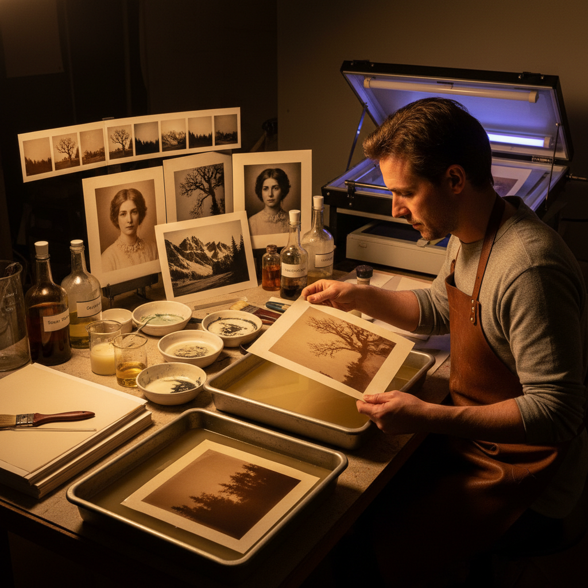

# Kallitype 卡利版印刷

> "Kallitype is the poor man's platinum — iron salts and silver nitrate producing prints of extraordinary tonal beauty in colors from warm sepia to cool neutral black, a process that rivals platinum in visual quality at a fraction of the cost, each print hand-coated and sun-printed with the patience of a 19th century craftsman." — Unknown

## 概述

卡利版印刷（Kallitype）是一种使用铁盐（草酸铁）和银盐（硝酸银）在紫外线曝光下产生金属银图像的替代摄影印刷工艺。卡利版由W.W.J. Nicol在1889年发明，因其能够产生类似铂金印刷的色调质量而被称为"穷人的铂金"（poor man's platinum）。

卡利版印刷与范戴克棕印刷类似，但更加精细和可控。卡利版的独特之处在于其色调的多样性——通过使用不同的显影液（硼砂、碳酸钠、柠檬酸钠等）和调色处理（金调色、铂调色、钯调色等），可以产生从温暖的棕色到中性的黑色到冷色调的各种色彩。经过适当的调色和清洗，卡利版印刷品具有良好的永久性。

## 核心特征

| 特征 | 描述 |
|------|------|
| 铁银 | 铁盐和银盐 |
| 多色调 | 多种色调可能 |
| 显影 | 需要化学显影 |
| 调色 | 可用多种调色剂 |
| 精细 | 精细的色调控制 |
| 经济 | 比铂金印刷经济 |

## 视觉特征

- **色调**：丰富的色调变化
- **柔和**：柔和的色调过渡
- **深度**：深邃的暗部
- **质感**：与纸张融合的质感
- **多样**：从暖到冷的色调
- **铂金感**：类似铂金的质感

## 代表作品

| 作品 | 艺术家 | 年代 | 意义 |
|------|--------|------|------|
| *Kallitype prints* | W.W.J. Nicol | 1889 | 技法的发明 |
| *Toned kallitypes* | Various | 当代 | 调色卡利版 |
| *Kallitype landscapes* | Various | 当代 | 卡利版风景 |
| *Kallitype portraits* | Various | 当代 | 卡利版肖像 |
| *Contemporary kallitypes* | Various | 当代 | 当代卡利版 |

## 历史时间线

| 时期 | 事件 |
|------|------|
| 1889年 | W.W.J. Nicol发明kallitype |
| 1890-1920年代 | 卡利版的早期应用 |
| 20世纪中期 | 技法的衰落 |
| 1990年代 | 替代摄影运动中的复兴 |
| 当代 | 卡利版印刷的持续发展 |

## 中国语境

卡利版印刷在中国的替代摄影社区中有逐步的发展。中国的摄影艺术院校在高级替代摄影课程中教授卡利版技法。卡利版因其"类似铂金但成本更低"的特点，对中国的替代摄影爱好者有较大的吸引力。中国的一些替代摄影艺术家使用卡利版创作精美的手工印刷品，探索不同显影液和调色剂对色调的影响。

## AI生成概念图

## 与其他风格的关系

- **Platinum Printing** → 铂金印刷
- **Van Dyke Brown** → 范戴克棕印刷
- **Salt Printing** → 盐纸印刷
- **Cyanotype** → 氰版印刷
- **Alternative Photography** → 替代摄影
- **Ziatype** → 齐亚版印刷

---

*浮光艺志 | Chronicle of Artistry*
