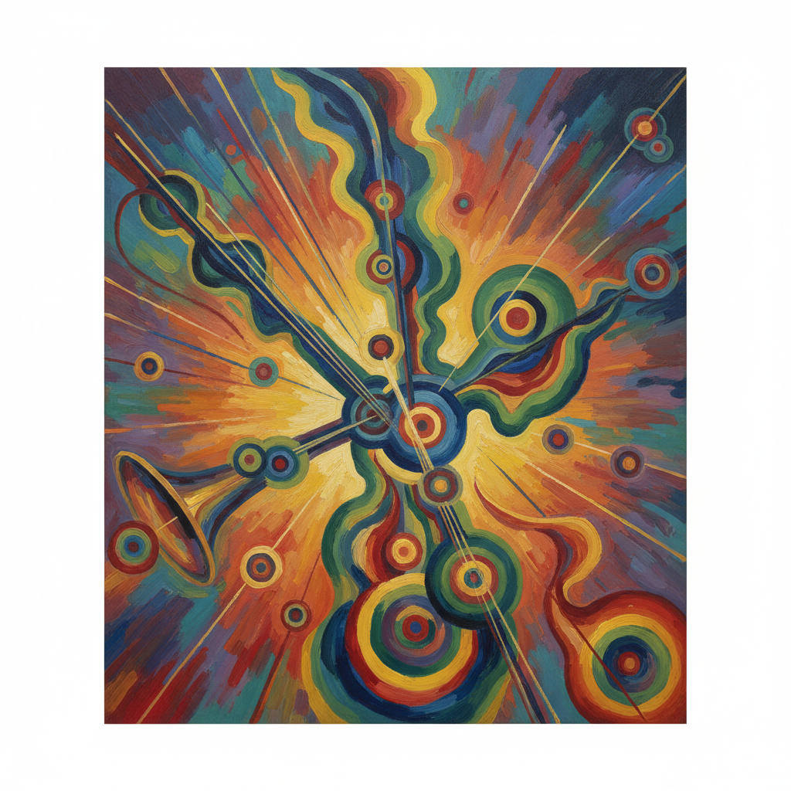

# Kandinsky Art 康定斯基艺术

> "Color is the keyboard, the eyes are the harmonies, the soul is the piano with many strings." — Wassily Kandinsky

## 概述

康定斯基艺术（Kandinsky Art）是20世纪初俄裔画家瓦西里·瓦西里耶维奇·康定斯基（Wassily Wassilyevich Kandinsky, 1866-1944）创立的抒情抽象绑画风格。康定斯基被公认为西方抽象艺术的先驱之一——他在1910年前后创作了最早的纯抽象绑画，并以《论艺术中的精神》（1911）一书为抽象艺术提供了系统的理论基础。他相信色彩和形式可以像音乐一样直接触动灵魂——无需借助任何具象的再现。

康定斯基的艺术经历了从具象到抽象的完整演变：早期受俄罗斯民间艺术和印象派影响；中期在慕尼黑创立"蓝骑士"运动，发展出自由奔放的抒情抽象；后期在包豪斯任教时转向更加几何化和理性化的构图。他的作品如《构图》系列，以色彩、线条和形状的自由组合创造出如交响乐般的视觉体验。

康定斯基艺术的核心要素包括：1）抒情抽象——色彩和形式的自由表达；2）音乐性——绑画与音乐的通感；3）精神性——艺术的精神使命；4）色彩理论——系统的色彩心理学；5）点线面——基本视觉元素的理论；6）内在必然性——艺术创作的内在驱动；7）综合艺术——不同艺术形式的融合。

## 核心特征

| 特征 | 描述 |
|------|------|
| 抒情抽象 | 色彩形式自由表达 |
| 音乐性 | 绑画与音乐通感 |
| 精神性 | 艺术的精神使命 |
| 色彩理论 | 系统色彩心理学 |
| 点线面 | 基本视觉元素理论 |
| 内在必然性 | 艺术创作内在驱动 |

## 视觉特征

- **自由线条**：流动而有节奏的线条
- **色彩丰富**：多种色彩的和谐组合
- **几何与有机**：几何形与有机形的混合
- **动态构图**：充满运动感的构图
- **音乐节奏**：如乐谱般的视觉节奏
- **空间深度**：色彩创造的空间层次

## 代表作品

| 作品 | 年代 | 意义 |
|------|------|------|
| *构图VII* (Composition VII) | 1913 | 抒情抽象巅峰 |
| *构图VIII* (Composition VIII) | 1923 | 几何抽象转型 |
| *即兴28* (Improvisation 28) | 1912 | 音乐性绑画 |
| *黄红蓝* (Yellow-Red-Blue) | 1925 | 色彩理论实践 |
| *几个圆* (Several Circles) | 1926 | 几何的诗意 |
| *天空之蓝* (Sky Blue) | 1940 | 晚期生物形态 |

## 历史时间线

| 时期 | 事件 |
|------|------|
| 1866年 | 出生于莫斯科 |
| 1896年 | 放弃法学，赴慕尼黑学画 |
| 1910年 | 创作第一幅抽象水彩 |
| 1911年 | 创立"蓝骑士"运动 |
| 1914-1921年 | 回到俄罗斯 |
| 1922-1933年 | 在包豪斯任教 |
| 1933-1944年 | 移居巴黎 |
| 1944年 | 在巴黎去世 |

## 中国语境

康定斯基在中国当代艺术和设计教育中有着深远的影响。他的《论艺术中的精神》和《点线面》是中国美术院校的必读经典——为中国艺术家理解抽象艺术提供了系统的理论框架。康定斯基关于"内在必然性"的理论——艺术创作应该源于内心的精神需要而非外在的模仿——与中国传统美学中"气韵生动"和"写意"的理念有深层的共鸣。中国当代抽象艺术家如赵无极、朱德群等都受到康定斯基的影响——他们将东方书法的韵律与西方抽象的形式相结合。康定斯基的"绑画如音乐"的理念也与中国传统"书画同源"的观念有相通之处——都追求超越具象的精神表达。

## 概念图

## 与其他风格的关系

- **Abstract Art** → 抽象艺术（先驱）
- **Malevich** → 马列维奇（至上主义）
- **Blue Rider** → 蓝骑士运动（创始人）
- **Bauhaus** → 包豪斯
- **Expressionism** → 表现主义
- **Mondrian** → 蒙德里安（几何抽象）

---

*浮光艺志 | Chronicle of Artistry*
