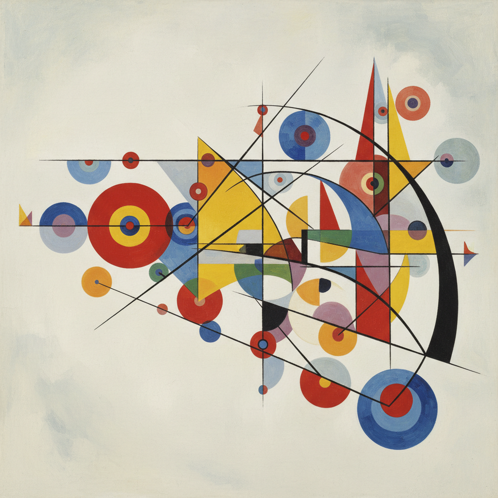

# Wassily Kandinsky 康定斯基

> "Color is the keyboard, the eyes are the harmonies, the soul is the piano with many strings." — Wassily Kandinsky

## 概述

瓦西里·康定斯基（Wassily Wassilyevich Kandinsky，1866–1944）是俄裔法国画家和艺术理论家，被广泛认为是西方抽象艺术的先驱之一。他在1910年前后创作了第一批完全非具象的绘画，从此将绘画从对外部世界的再现中彻底解放出来。

康定斯基相信色彩和形式能像音乐一样直接触动灵魂——他的画作标题常使用音乐术语（Composition、Improvisation、Impression），他的理论著作《论艺术中的精神》（1911）和《点、线、面》（1926）是抽象艺术最重要的理论基础。

## 核心特征

| 特征 | 描述 |
|------|------|
| 纯抽象 | 完全脱离具象——纯粹的色彩和形式 |
| 音乐性 | 绘画如同视觉音乐——节奏、和声、旋律 |
| 精神性 | 艺术是灵魂的表达，不是眼睛的记录 |
| 色彩理论 | 每种颜色有特定的精神和情感含义 |
| 几何化 | 包豪斯时期走向严格的几何抽象 |
| 理论体系 | 建立了完整的抽象艺术理论 |

## 风格阶段

| 时期 | 年代 | 特点 |
|------|------|------|
| 慕尼黑时期 | 1896-1911 | 从具象到抽象的过渡 |
| 蓝骑士时期 | 1911-14 | 自由的、表现性的抽象 |
| 俄国时期 | 1914-21 | 构成主义影响 |
| 包豪斯时期 | 1922-33 | 严格的几何抽象——圆、三角、方 |
| 巴黎时期 | 1934-44 | 生物形态的有机抽象 |

## 视觉特征

- **形式**：从自由曲线到严格几何的演变
- **色彩**：鲜明的纯色——蓝、黄、红的精神含义
- **线条**：有力的、有方向性的线条运动
- **构图**：动态的、音乐性的空间组织
- **背景**：从白色到彩色的活跃背景
- **元素**：圆形、三角形、方形的基本几何

## 代表作品

| 作品 | 年代 | 意义 |
|------|------|------|
| *Composition VII* | 1913 | 最复杂的早期抽象——视觉交响曲 |
| *Several Circles* | 1926 | 包豪斯时期的几何纯粹 |
| *Yellow-Red-Blue* | 1925 | 色彩理论的视觉化 |
| *On White II* | 1923 | 动态与静态的对比 |
| *Sky Blue* | 1940 | 巴黎时期的生物形态 |

## 真实作品（公共领域）

康定斯基的部分作品已进入公共领域：

| 作品 | 来源 |
|------|------|
| *Composition VII* | [Tretyakov Gallery](https://www.tretyakovgallery.ru/en/) |
| *Several Circles* | [Guggenheim](https://www.guggenheim.org/artwork/1992) |

> ⚠️ 康定斯基的部分作品仍受版权保护。本条目使用AI生成概念图展示风格特征。

## AI生成概念图

## 与其他风格的关系

- **Abstract Art** → 西方抽象艺术的先驱
- **Der Blaue Reiter** → 蓝骑士运动的创始人
- **Bauhaus** → 包豪斯学院的重要教师
- **Expressionism** → 从表现主义发展到抽象
- **Suprematism** → 与马列维奇的俄国抽象并行
- **Color Field** → 色域绘画的理论先驱

---

*浮光艺志 | Chronicle of Artistry*
