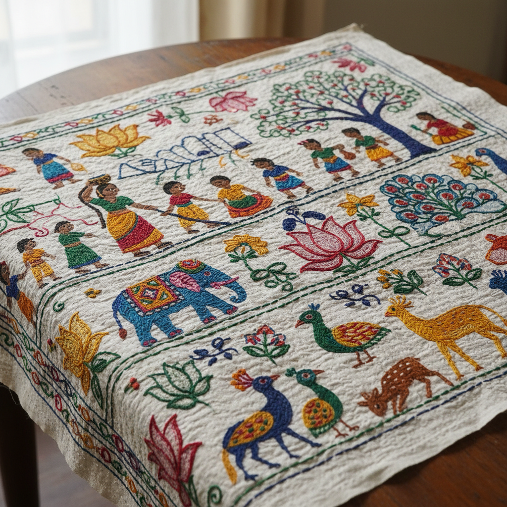

# Kantha Art 坎塔刺绣艺术

> "Kantha is storytelling in stitch — Bengali women layer old saris and dhotis, then join them with simple running stitches that ripple across the surface like water, filling the cloth with narratives of daily life, mythology, and nature. The characteristic wavy texture comes from the slight gathering of each stitch, transforming discarded textiles into quilted treasures that carry generations of memory." — Unknown

## 概述

坎塔刺绣艺术（Kantha Art）是一种起源于孟加拉地区（包括印度西孟加拉邦和孟加拉国）的传统刺绣和绗缝技法——通过将多层旧纱丽或棉布叠放，用简单的平针（running stitch）缝合并装饰图案。坎塔以其独特的波浪纹理、叙事性图案和废物再利用的精神著称。

坎塔刺绣艺术的实践包括：1）平针缝合（Running Stitch）——基本的前进针法；2）叙事图案——描绘日常生活和神话故事；3）莲花图案——经典的莲花和生命之树；4）边框设计——装饰性的边框图案；5）废物再利用——将旧纱丽转化为新作品；6）Nakshi Kantha——精细的装饰性坎塔；7）当代坎塔——将传统技法与现代设计结合的创作。

## 核心特征

| 特征 | 描述 |
|------|------|
| 平针 | 简单的平针缝法 |
| 波浪 | 特征性的波浪纹理 |
| 叙事 | 叙事性的图案 |
| 再利用 | 旧布的再利用 |
| 孟加拉 | 孟加拉地区传统 |
| 多层 | 多层布的绗缝 |

## 视觉特征

- **波浪**：特征性的波浪纹理
- **叙事**：叙事性的图案设计
- **色彩**：旧纱丽的丰富色彩
- **质朴**：质朴手工的美感
- **密集**：密集的平针覆盖
- **生动**：生动的生活场景

## 代表作品

| 作品 | 艺术家/文化 | 年代 | 意义 |
|------|-------------|------|------|
| *Nakshi Kantha* | 孟加拉 | 传统 | 精细装饰坎塔 |
| *Lep Kantha* | 孟加拉 | 传统 | 绗缝被褥坎塔 |
| *Sujni Kantha* | 比哈尔 | 传统 | 苏杰尼坎塔 |
| *Contemporary Kantha* | 印度 | 当代 | 当代坎塔设计 |
| *Kantha revival textiles* | 孟加拉 | 当代 | 坎塔复兴纺织品 |

## 历史时间线

| 时期 | 事件 |
|------|------|
| 古代 | 坎塔传统的起源 |
| 中世纪 | 孟加拉坎塔的发展 |
| 19世纪 | 坎塔的记录和收藏 |
| 20世纪 | 坎塔的衰落和复兴 |
| 当代 | 坎塔的国际化和商业化 |

## 中国语境

坎塔与中国的一些传统纺织实践有相似之处。中国的百衲衣（用碎布拼缝的衣物）——与坎塔的废物再利用精神相似。中国的绗缝传统中，用平针缝合多层布料——与坎塔的基本技法相同。中国的民间刺绣中，叙事性的图案（如百子图、耕织图）——与坎塔的叙事传统有共鸣。中国当代的可持续时尚运动中，坎塔作为废物再利用的典范——被引用和学习。中国的纤维艺术教育中，坎塔作为南亚纺织传统的代表——在比较研究中被提及。中国的手工市场中，坎塔风格的家居纺织品——作为异域风格产品有一定市场。

## AI生成概念图

## 与其他风格的关系

- **Sashiko** → 刺子绣
- **Boro** → 日本缝补艺术
- **Quilting** → 绗缝
- **Folk Art** → 民间艺术
- **Textile Art** → 纺织艺术
- **Sustainable Design** → 可持续设计

---

*浮光艺志 | Chronicle of Artistry*
