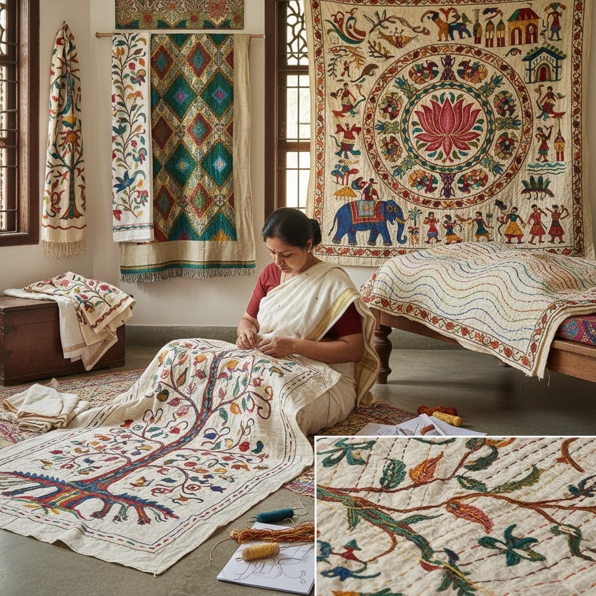

# Kantha Embroidery 坎塔刺绣

> "Kantha is storytelling in stitch — layers of old saris quilted together with simple running stitches that ripple across the surface like water, each woman's needle drawing her world in thread: lotus flowers, elephants, the tree of life, scenes from daily existence transformed into cloth narratives passed from mother to daughter." — Unknown

## 概述

坎塔刺绣（Kantha）是南亚（主要是孟加拉地区——包括印度西孟加拉邦和孟加拉国）的传统刺绣和绗缝技法。Kantha的基本做法是将多层旧纱丽（sari）叠在一起，用简单的平针（running stitch）将它们缝合，同时在表面绣出装饰性图案。Kantha一词来自梵语"kontha"（碎布）。

Kantha有数百年的历史——孟加拉地区的妇女将穿旧的纱丽叠成多层，用从纱丽边缘抽出的彩色丝线缝制。Kantha的图案包括：莲花、生命之树、大象、鱼、太阳、几何图案以及日常生活场景。Kantha的针法简单（主要是平针），但通过针脚的方向和密度变化创造出丰富的纹理效果——密集的平针使织物表面产生独特的褶皱纹理（ripple effect）。当代Kantha在全球时尚和家居装饰中有重要影响。

## 核心特征

| 特征 | 描述 |
|------|------|
| 平针 | 简单的平针技法 |
| 多层 | 多层旧纱丽叠加 |
| 叙事 | 叙事性的图案 |
| 褶皱 | 独特的褶皱纹理 |
| 回收 | 旧织物的再利用 |
| 女性 | 女性的传统技艺 |

## 视觉特征

- **褶皱**：平针造成的褶皱纹理
- **叙事**：叙事性的图案设计
- **色彩**：纱丽丝线的丰富色彩
- **流动**：针迹的流动感
- **质朴**：手工的质朴温暖
- **层次**：多层织物的厚度

## 代表作品

| 作品 | 艺术家 | 年代 | 意义 |
|------|--------|------|------|
| *Traditional nakshi kantha* | 孟加拉妇女 | 传统 | 传统叙事坎塔 |
| *Lep kantha* | 孟加拉妇女 | 传统 | 坎塔被褥 |
| *Contemporary kantha quilts* | Various | 当代 | 当代坎塔绗缝 |
| *Kantha fashion* | Various | 当代 | 坎塔时尚 |
| *Art kantha* | Various | 当代 | 艺术坎塔 |

## 历史时间线

| 时期 | 事件 |
|------|------|
| 古代 | 孟加拉地区Kantha的起源 |
| 中世纪 | Kantha的发展和传播 |
| 英国殖民时期 | Kantha的持续实践 |
| 独立后 | Kantha的商业化发展 |
| 当代 | Kantha的全球影响 |

## 中国语境

坎塔刺绣在中国的认知度相对有限，但随着全球纺织艺术的交流，中国的纤维艺术社区开始关注Kantha。中国传统的绗缝技法（如棉被的绗缝）与Kantha有功能上的相似性——都是用平针将多层织物缝合。中国的"百衲被"传统与Kantha的旧织物再利用理念相通。当代中国的一些纺织艺术家在创作中借鉴Kantha的针迹纹理效果。中国的可持续时尚品牌中有受Kantha启发的设计。

## AI生成概念图

## 与其他风格的关系

- **Sashiko** → 刺子绣
- **Quilting** → 绗缝
- **Boro** → 襤褸织物
- **Embroidery** → 刺绣
- **Folk Art** → 民间艺术
- **Sustainable Textile** → 可持续纺织

---

*浮光艺志 | Chronicle of Artistry*
