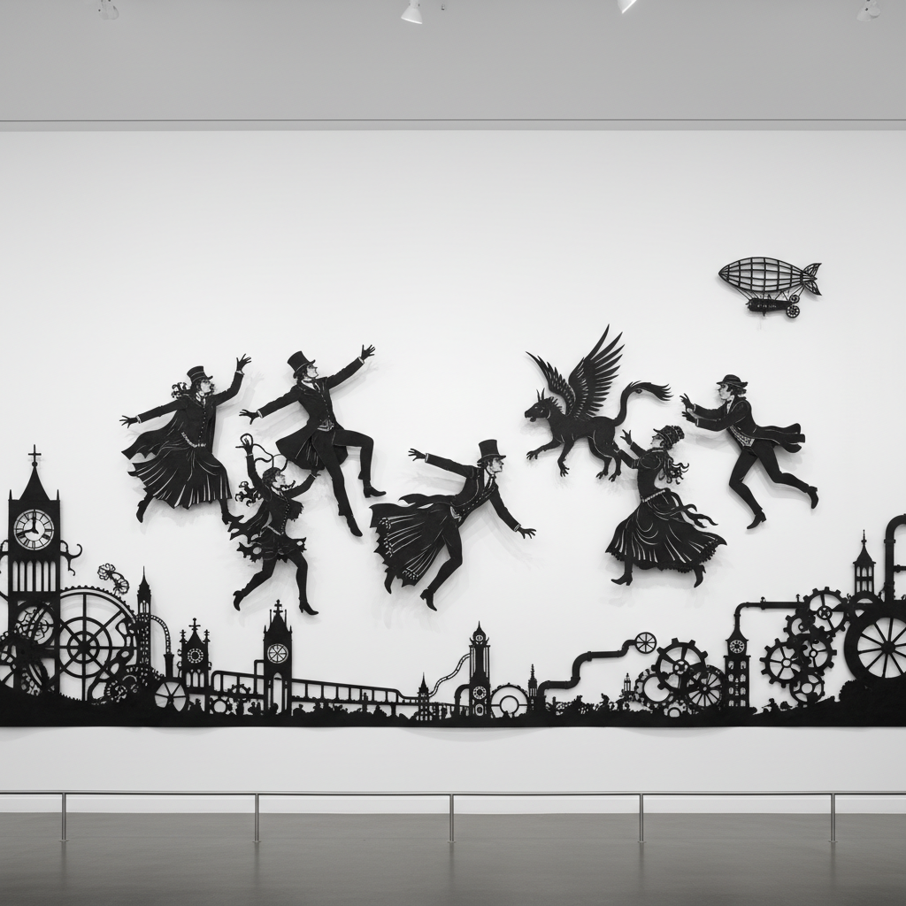

# Kara Walker 卡拉·沃克

> **流派**: 当代艺术 · 剪影艺术 · 装置艺术  
> **时期**: 1969–至今 美国  
> **关键词**: 黑色剪影、种族历史、南方叙事、暴力与美

## 概述

卡拉·沃克以巨幅黑色剪影装置闻名于世。她用维多利亚时代的剪影肖像传统——一种看似优雅无害的艺术形式——来讲述美国奴隶制和种族暴力的残酷历史。黑白剪影的简洁形式与其所描绘内容的复杂性形成强烈张力，迫使观众直面被美化或遗忘的历史。

## 视觉特征

- **黑色剪影**: 大尺度黑色纸张剪切贴于白墙
- **叙事场景**: 多人物构图讲述复杂故事
- **维多利亚风格**: 借用19世纪剪影肖像的优雅轮廓
- **暴力内容**: 奴隶制、性暴力、种族压迫的直接描绘
- **环境装置**: 剪影覆盖整面墙壁，观众置身其中

## 代表作品

- 《消逝》(Gone, 1994) — 首个大型剪影装置
- 《精妙》(A Subtlety, 2014) — 巨型糖雕塑
- 《起义！》(Insurrection!, 2000) — 投影装置
- 《我的补充》(My Complement, My Enemy..., 2007)

## 历史影响

沃克证明了最简单的视觉形式——黑白剪影——可以承载最沉重的历史叙事。她重新激活了被遗忘的艺术传统，并将其转化为讨论种族、性别和权力的当代武器。

## 相关风格

- [William Kentridge 威廉·肯特里奇](william-kentridge.md)
- [Installation Art 装置艺术](installation-art.md)
- [Silhouette Art 剪影艺术](silhouette-art.md)
