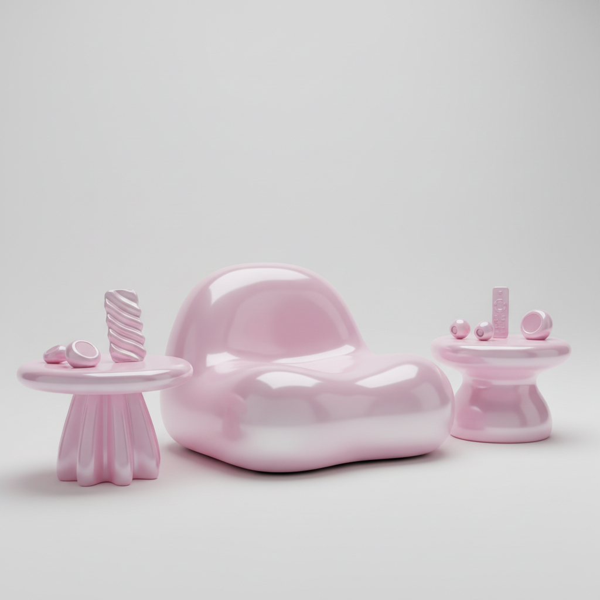

# Karim Rashid 卡里姆·拉希德

> **时期：** 1960–至今  
> **关键词：** 数字有机、粉色与白色、blob美学、感官设计

## 概述

Karim Rashid 是埃及裔加拿大设计师，以色彩鲜艳的有机形态设计闻名。他的作品充满圆润的blob形状、糖果色和未来感——从垃圾桶到夜店、从香水瓶到公寓，一切都被包裹在柔软的、数字时代的曲面中。

## 风格特征

- **Blob形态**：圆润、膨胀的有机曲面
- **糖果色**：粉色、白色、荧光绿等高饱和色彩
- **数字美学**：设计看起来像3D软件渲染的结果
- **感官主义**：强调触觉、视觉的愉悦体验
- **无处不在**：从$5的垃圾桶到$5000的家具

## 代表作品

- *Garbo 垃圾桶*（1996，Umbra）
- *Oh Chair*（2004，Umbra）
- *Bobble 水瓶*
- *Morimoto 餐厅*（纽约）

## 概念图

