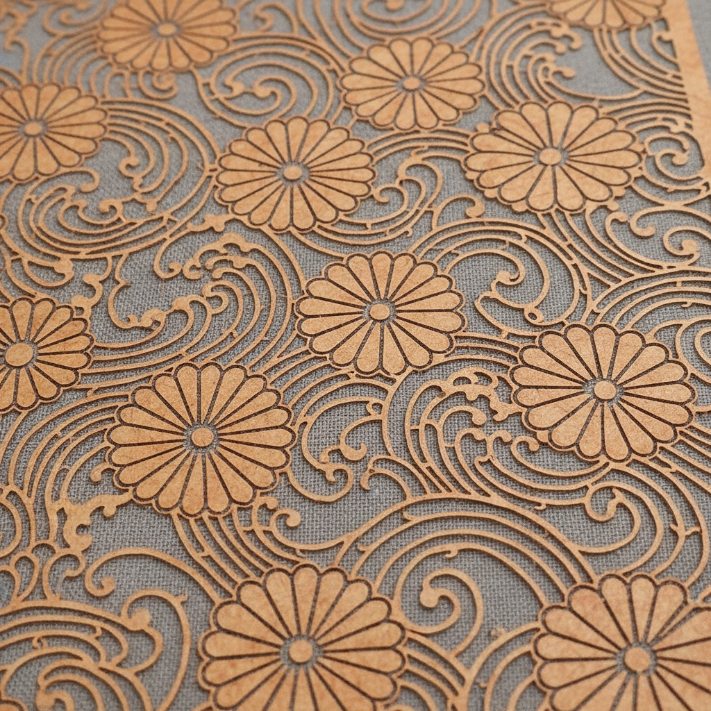

# Katagami 型紙 | かたがみ

> **"纸上的蕾丝——日本工匠用小刀在柿涩纸上雕出比机器更精密的镂空图案。"**

## 概述

型紙（Katagami / かたがみ）是日本传统的纸质染色模板，用于和服等织物的型染（Katazome）工艺。工匠在经过柿涩（柿渋 kakishibu）处理的和纸上，用极细的小刀雕刻出精密的镂空图案，然后通过这些镂空将染料印到织物上。一张型紙可能包含数千个微小的刀痕，精密程度令人难以置信。型紙在19世纪末传入欧洲后，深刻影响了新艺术运动（Art Nouveau）和工艺美术运动（Arts & Crafts）的装饰设计。

## 核心特征

- **柿涩纸**：柿渋处理的防水和纸
- **镂空雕刻**：极精密的小刀雕刻
- **染色模板**：用于型染工艺
- **重复图案**：可重复使用的模板
- **极精密**：数千个微小刀痕
- **丝网加固**：细丝网固定悬浮部分

## 主要技法

| 技法 | 日语 | 特征 |
|------|------|------|
| 突雕 | 突彫 Tsukibori | 小刀推刻 |
| 引雕 | 引彫 Hikibori | 拉刀雕刻 |
| 道具雕 | 道具彫 Dōgubori | 模具冲压 |
| 锥雕 | 錐彫 Kiribori | 锥子打孔 |
| �的雕 | 縞彫 Shimabori | 细条纹 |

## 视觉特征

- 极精密的镂空图案
- 柿涩纸的棕色质感
- 重复的几何和自然图案
- 正负形的视觉张力
- 蕾丝般的精细程度
- 光影穿透的效果

## 与其他风格的关系

| 风格 | 关系 |
|------|------|
| Art Nouveau | 型紙直接影响了新艺术运动 |
| William Morris | 受型紙启发的纺织设计 |
| 剪纸 Paper Cutting | 共享镂空技法 |
| 丝网印刷 | 型紙是丝网印刷的前身 |
| 当代激光切割 | 型紙美学的数字转化 |

## 概念图

---

*浮光艺志 | Chronicle of Artistry*
