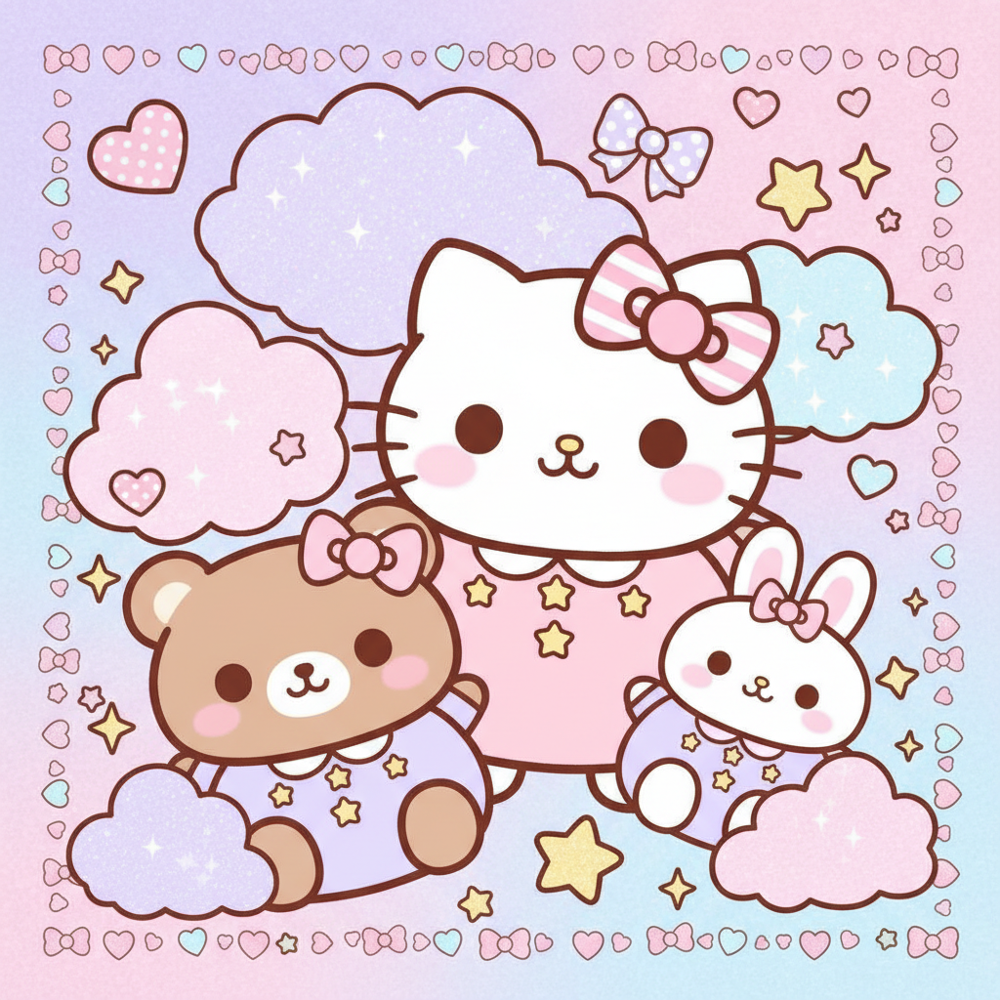

# Kawaii 卡哇伊



> **"圆圆的眼睛、粉色腮红、万物皆可萌——日本'可爱'文化征服了全世界。"**

## 概述

| 维度 | 描述 |
|------|------|
| 时期 | 1970s 起源 / 持续至今 |
| 别名 | Kawaii, Cute Culture, カワイイ |
| 核心色彩 | 粉色、淡紫、天蓝、白色、黄色 |
| 关键元素 | 圆形、大眼睛、腮红、星星、爱心、蝴蝶结 |
| 代表人物 | Hello Kitty、三丽鸥、卡娜赫拉、角落生物 |
| 关联风格 | Harajuku Y2K, Soft Girl, Fairycore, Kidcore |

---

## 历史脉络

### 1970s：可爱的诞生

| 年份 | 事件 |
|------|------|
| 1974 | Hello Kitty 诞生 |
| 1970s | 日本少女开始使用圆体手写字 |
| 1980s | 三丽鸥帝国扩张，Kawaii 成为亚文化 |
| 1990s | 原宿街头文化将 Kawaii 推向极致 |
| 2000s | Kawaii 通过互联网全球化 |
| 2010s–至今 | 角落生物、卡娜赫拉等新IP持续输出 |

### 文化基因

| 来源 | 贡献 |
|------|------|
| 少女漫画 | 大眼睛、星星瞳孔 |
| 三丽鸥 | 将"可爱"商品化 |
| 原宿 | 将"可爱"穿在身上 |
| 便利店文化 | 万物皆可萌化 |
| 表情包 | 颜文字 (╹◡╹) |

### 核心哲学

Kawaii 的深层意义远超"好看"：
- **反抗**：拒绝成人世界的严肃和压力
- **治愈**：在高压社会中寻找柔软
- **连接**：可爱是跨文化的通用语言
- **赋权**：选择"可爱"是一种自主权

---

## 视觉语法

### 色彩系统

```
主色：
  粉色 (#FFB6C1) — 腮红、爱心
  淡紫 (#E6E6FA) — 梦幻
  天蓝 (#87CEEB) — 清新
  白色 (#FFFFFF) — 纯净
  黄色 (#FFFF00) — 活力、星星

辅色：
  薄荷绿 (#98FB98) — 清凉
  奶油色 (#FFFDD0) — 温暖
  珊瑚粉 (#FF7F50) — 活泼

质感：
  圆润 — 一切都是圆的
  柔软 — 毛绒、棉花糖
  透明 — 果冻、水晶
  闪亮 — 亮片、星星
  手绘 — 简笔画风格
```

### 标志性元素

| 类别 | 元素 |
|------|------|
| 表情 | 大眼睛、腮红、微笑、(◕‿◕) |
| 符号 | 星星、爱心、蝴蝶结、云朵、彩虹 |
| 角色 | Hello Kitty、布丁狗、美乐蒂、角落生物 |
| 食物 | 棉花糖、马卡龙、冰淇淋、珍珠奶茶 |
| 服装 | 蝴蝶结、蕾丝、蓬蓬裙、过膝袜 |
| 文具 | 贴纸、手账、彩色笔、印章 |

---

## 与千禧怀旧的关系

### 2000s 的 Kawaii 全球化
- Hello Kitty 在 2000s 达到全球巅峰
- 千禧一代的童年充满三丽鸥产品
- 日本动漫/游戏将 Kawaii 美学传播到全世界

### 与当代 -core 的交叉
- Soft Girl = Kawaii + TikTok
- Fairycore = Kawaii + 自然
- Kidcore = Kawaii + 童年怀旧

---

## 中国语境

- "萌"文化的全面渗透
- 卡娜赫拉、角落生物在中国的流行
- "萌化"一切：萌宠、萌物、萌系穿搭
- 手账文化、贴纸文化
- 泡泡玛特等潮玩的 Kawaii 基因

---

## 设计应用

| 场景 | 应用方式 |
|------|----------|
| 品牌 | 圆角+粉色+手绘角色+可爱字体 |
| 包装 | 马卡龙色+圆形+角色IP+贴纸 |
| UI | 圆角+柔和色+微动效+表情 |
| 空间 | 粉色+毛绒+圆形家具+角色装饰 |

---

## 相关风格

← [Harajuku Y2K 原宿千禧](harajuku-y2k.md) | [Soft Girl 软妹风](soft-girl.md) →

↑ [返回千禧怀旧目录](README.md) | [返回总目录](../README.md)
