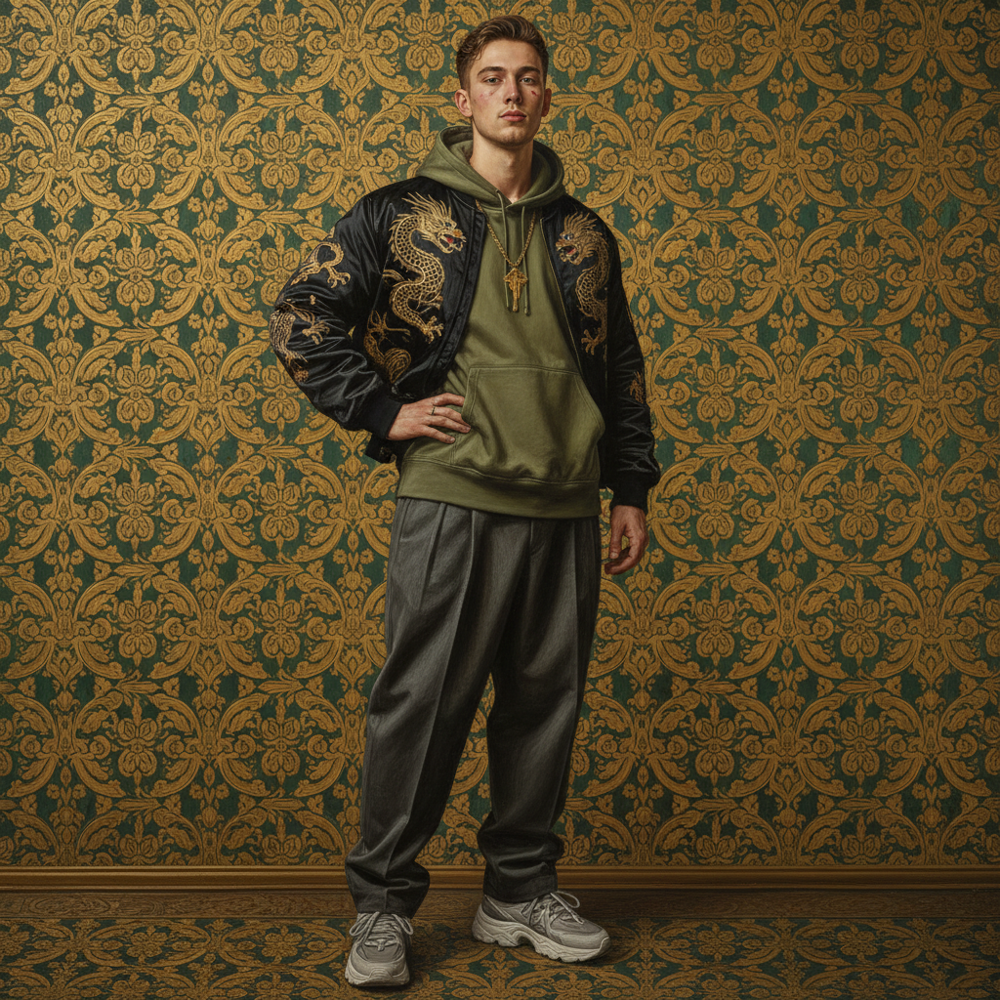

# Kehinde Wiley 凯欣德·威利

> **流派**: 当代肖像画 · 后殖民艺术  
> **时期**: 1977–至今 美国  
> **关键词**: 黑人肖像、古典挪用、装饰花纹、权力再分配

## 概述

凯欣德·威利以将黑人男性和女性置入欧洲古典绘画的构图中而闻名。他在街头邀请普通人摆出拿破仑、圣母或贵族的姿态，然后用极其精细的写实技法绘制巨幅肖像，背景是华丽的装饰花纹。这种策略将历史上被排斥在权力图像之外的人群重新置入艺术史的中心。

## 视觉特征

- **古典姿态**: 借用文艺复兴和巴洛克绘画的构图
- **装饰背景**: 华丽的花卉、藤蔓图案覆盖整个背景
- **当代服饰**: 人物穿着运动服、牛仔裤等当代服装
- **超大尺幅**: 作品通常超过2米高
- **精细写实**: 极其细腻的皮肤和织物质感

## 代表作品

- 奥巴马总统官方肖像 (2018)
- 《拿破仑穿越阿尔卑斯山》(2005) — 挪用大卫
- 《世界舞台》(World Stage) 系列
- 《向下》(Down) 系列

## 历史影响

威利通过将黑人身体置入西方艺术史的经典构图中，揭示了肖像画传统中的种族权力结构，同时为当代黑人创造了新的视觉尊严。他是21世纪最具公众影响力的画家之一。

## 相关风格

- [Amy Sherald 艾米·谢拉尔德](amy-sherald.md)
- [Portrait Painting 肖像画](portrait-painting.md)
- [Post-Colonial Art 后殖民艺术](post-colonial-art.md)
