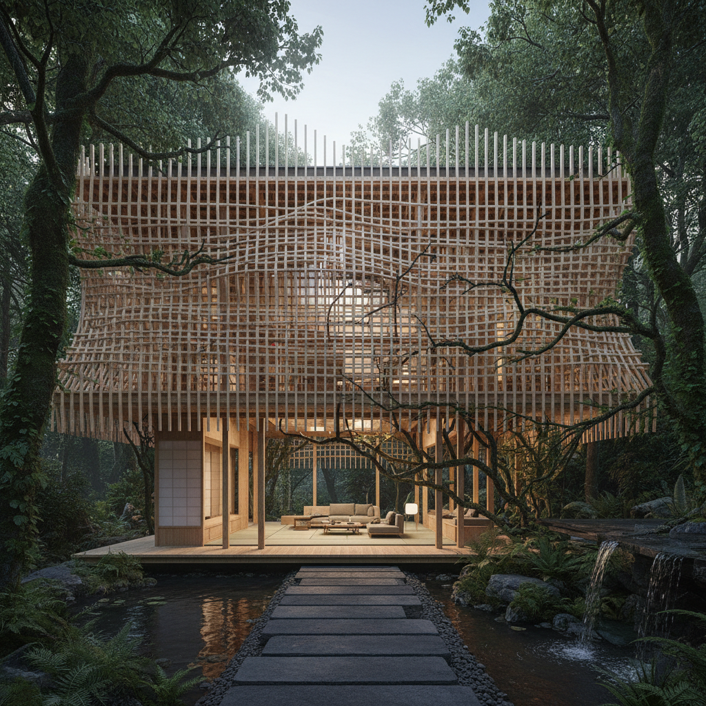

# Kengo Kuma 隈研吾

> **时期：** 1954–至今  
> **关键词：** 负建筑、木构编织、消解边界、在地材料

## 概述

Kengo Kuma 是日本建筑师，以"让建筑消失"的理念闻名。他用细小的木条、竹片、石板等在地材料编织建筑表皮，让建筑融入环境而非对抗环境——如同一层轻盈的面纱覆盖在大地上，模糊了内外、建筑与自然的边界。

## 风格特征

- **木构编织**：细小木条或竹片的重复排列形成半透明表皮
- **负建筑**：建筑不是"存在"而是"消失"在环境中
- **在地材料**：使用当地传统材料和工艺
- **光的过滤**：编织表皮过滤光线创造柔和的室内氛围
- **粒子化**：将建筑分解为无数小单元的集合

## 代表作品

- *东京国立竞技场*（2019）
- *中国美术学院民艺博物馆*（2015）
- *浅草文化观光中心*（2012）
- *V&A邓迪分馆*（2018）

## 概念图

