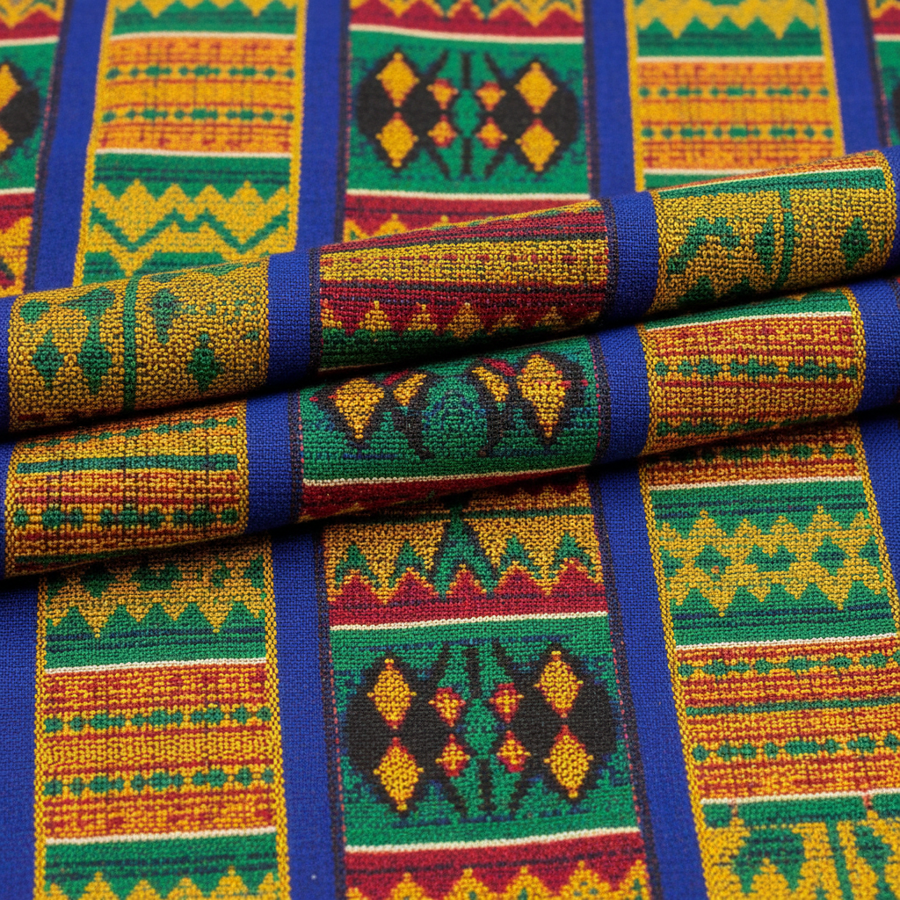

# Kente Cloth 肯特布 | Kente

> **"每一条线都有名字——阿散蒂王国用丝线编织权力与智慧的密码。"**

## 概述

肯特布（Kente / Kente Cloth）是西非加纳阿散蒂族（Ashanti/Asante）和埃维族（Ewe）的传统手织布，是非洲最著名的纺织艺术之一。"Kente"源自Akan语"kenten"（篮子），因其编织图案类似篮编。传统上，肯特布是阿散蒂国王和贵族的专属服饰，每种图案都有特定的名称和象征意义。织布在窄条织机上完成，多条窄布缝合成大幅。今天，肯特布已成为泛非洲身份和黑人骄傲的全球象征。

## 核心特征

- **窄条织造**：在4英寸宽的窄条织机上织造
- **缝合成幅**：多条窄布缝合成大幅布料
- **丝线和棉线**：传统使用丝线，现代也用棉线和人造丝
- **几何图案**：条纹、方格、锯齿等几何设计
- **命名系统**：每种图案有特定名称和含义
- **色彩象征**：每种颜色有特定的象征意义

## 色彩象征

| 颜色 | 含义 |
|------|------|
| 金/黄 | 王权、财富、成熟 |
| 蓝 | 和平、和谐、爱 |
| 绿 | 生长、丰饶、健康 |
| 红 | 政治力量、血液、牺牲 |
| 黑 | 成熟、精神力量 |
| 白 | 纯洁、节日、胜利 |
| 紫 | 女性、大地母亲 |

## 经典图案

| 图案名 | 含义 |
|--------|------|
| Adweneasa | "我的技艺已穷尽"——最复杂的设计 |
| Oyokoman | 阿散蒂王室专属 |
| Sika Futuro | "金尘"——财富 |
| Emaa Da | "前所未有"——创新 |
| Fathia Fata Nkrumah | 纪念加纳独立 |

## 视觉特征

- 鲜艳的多色条纹和方格
- 精确的几何图案
- 窄条缝合的独特节奏
- 丝线的光泽质感
- 复杂的经纬交织
- 大面积的视觉冲击

## 与其他风格的关系

| 风格 | 关系 |
|------|------|
| Bògòlanfini泥染布 | 共享西非纺织传统 |
| 安第斯纺织 | 共享窄条织造和身份标识 |
| 纳瓦霍织毯 | 共享几何纺织传统 |
| 当代非洲时装 | Kente是非洲时装的核心元素 |
| 非裔美国文化 | Kente是黑人骄傲的全球象征 |

## 概念图

---

*浮光艺志 | Chronicle of Artistry*
