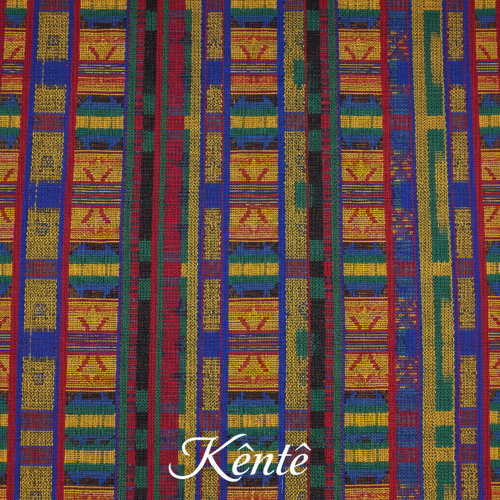

# Kente 肯特布 | Kente / Kɛntɛ

> **"国王的织布机——加纳阿散蒂人用窄条彩色丝绸编织出只有王室才能穿的几何密码。"**

## 概述

肯特布（Kente / Kɛntɛ）是加纳阿散蒂族（Ashanti / Asante）和埃维族（Ewe）的传统手工织布艺术，用窄条织机（strip loom）织出约10厘米宽的彩色布条，再将多条布条缝合成大幅布料。Kente在阿散蒂语中意为"篮子"（因其编织纹理类似篮编）。传统上，特定的图案和颜色组合只有王室和贵族才能穿着。每一种Kente图案都有独特的名称和象征含义——从谚语、历史事件到道德教训。Kente已成为泛非洲身份的全球象征。

## 核心特征

- **窄条织机**：约10厘米宽的布条
- **缝合成幅**：多条布条缝合
- **丝绸/棉线**：传统用丝，现代用棉
- **几何图案**：精确的几何编织
- **象征含义**：每种图案有名称和含义
- **王室传统**：特定图案限王室使用

## 经典图案

| 图案名 | 含义 |
|--------|------|
| Adweneasa | "我的技艺已穷尽" |
| Oyokoman | 阿散蒂王族 |
| Sika Futuro | "金尘" |
| Aberewa Ben | "老妇人的智慧" |
| Fathia Fata Nkrumah | 纪念恩克鲁玛 |

## 色彩含义

| 颜色 | 含义 |
|------|------|
| 金/黄 | 王权、财富 |
| 蓝 | 和平、和谐 |
| 绿 | 生长、丰饶 |
| 红 | 血液、牺牲 |
| 黑 | 成熟、精神力量 |
| 白 | 纯洁、节日 |

## 视觉特征

- 鲜艳的多色几何条纹
- 窄条拼接的节奏感
- 精确的编织图案
- 丝绸的光泽质感
- 大面积的包裹效果
- 王室的庄严感

## 与其他风格的关系

| 风格 | 关系 |
|------|------|
| Adire | 共享西非纺织传统 |
| Ankara/Wax Print | 共享非洲纺织文化 |
| Ikat | 共享编织图案传统 |
| 当代非洲时尚 | Kente的全球影响 |
| 泛非洲运动 | Kente作为身份象征 |

## 概念图

---

*浮光艺志 | Chronicle of Artistry*
