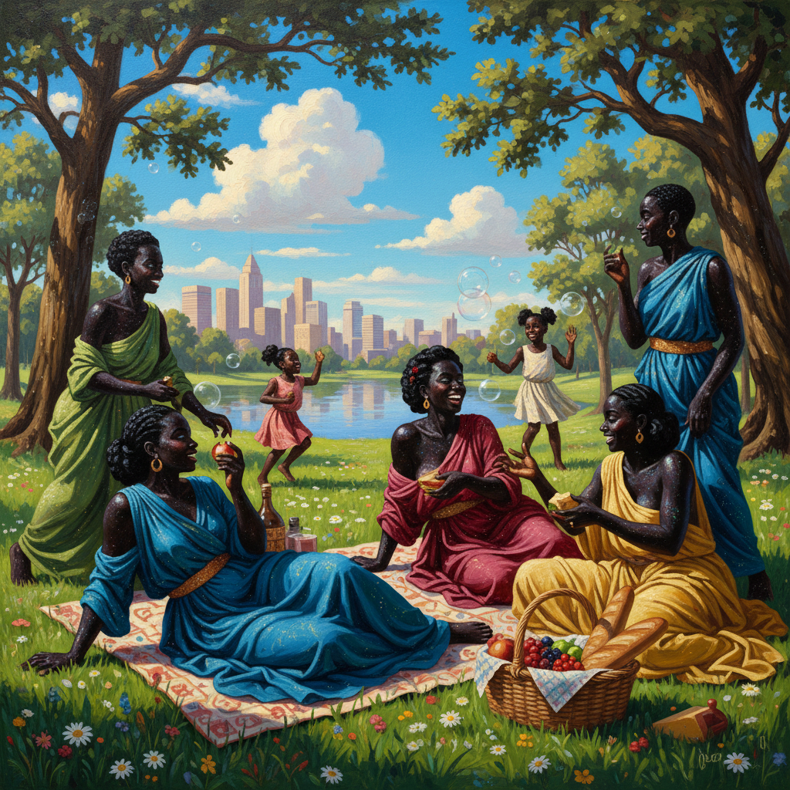

# Kerry James Marshall 凯里·詹姆斯·马歇尔

> **流派**: 当代绘画 · 具象艺术  
> **时期**: 1955–至今 美国  
> **关键词**: 极黑肤色、黑人日常、艺术史修正、大师级构图

## 概述

凯里·詹姆斯·马歇尔是当代最重要的美国画家之一。他刻意将黑人人物的皮肤画得极度深黑——比任何真实肤色都更黑——以此宣示黑色的美学力量和不可忽视性。他的大尺幅画作描绘黑人社区的日常生活（公园野餐、理发店、公寓楼），同时精心引用西方艺术史的经典构图，将黑人经验写入美术馆的正典。

## 视觉特征

- **极黑肤色**: 人物皮肤为纯黑色，几乎吸收所有光线
- **大师构图**: 借鉴文艺复兴、巴洛克和现代主义的构图法则
- **日常场景**: 公园、理发店、卧室等黑人社区空间
- **装饰元素**: 闪光粉、丝带、花朵等装饰性细节
- **文字嵌入**: 画面中常出现文字和标语

## 代表作品

- 《花园计划》(Garden Project) 系列 (1994–)
- 《过去的时光》(Past Times, 2018) — 拍卖价2110万美元
- 《大师级》(Mastry) 回顾展 (2016–17)
- 《无题（画室）》(Untitled (Studio), 2014)

## 历史影响

马歇尔证明了黑人形象可以在西方绘画传统中占据中心位置，而不仅仅是边缘注脚。他的"极黑"策略将黑色从缺席转化为压倒性的存在，影响了整整一代黑人画家。

## 相关风格

- [Kehinde Wiley 凯欣德·威利](kehinde-wiley.md)
- [Amy Sherald 艾米·谢拉尔德](amy-sherald.md)
- [Contemporary Figurative Art 当代具象艺术](contemporary-figurative-art.md)
