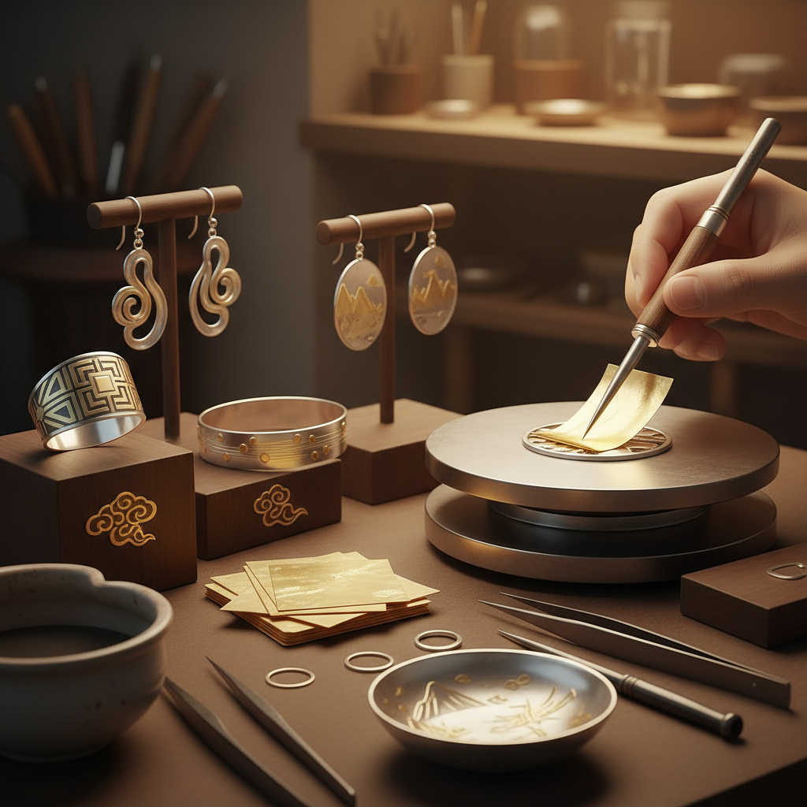

# Keum-boo 金箔贴合

> "Keum-boo is gold married to silver by heat and pressure alone — no solder, no adhesive, just the ancient Korean secret of diffusion bonding that fuses precious metals at the atomic level." — Unknown

## 概述

金箔贴合（Keum-boo，韩语금부，意为"附着金"）是一种韩国传统的金属装饰技法——将极薄的纯金箔通过加热和压力直接贴合到银（或其他金属）表面，利用扩散焊接（diffusion bonding）原理使金箔与银永久结合。Keum-boo不需要焊料或粘合剂——仅靠热量（约350-400°C）和压力就能使金原子与银原子在界面处相互扩散，形成牢固的冶金结合。

Keum-boo的魅力在于：它能在银器表面创造出金色的装饰图案——金色与银色的对比极其优雅。由于使用的是纯金箔（24K），金色非常纯正温暖。Keum-boo可以贴合各种形状的金箔——从简单的几何形到复杂的图案。这种技法在当代首饰制作中极受欢迎。

## 核心特征

| 特征 | 描述 |
|------|------|
| 金箔 | 纯金箔贴合 |
| 扩散 | 扩散焊接原理 |
| 韩国 | 韩国传统技法 |
| 无焊 | 不需要焊料 |
| 双色 | 金银双色效果 |
| 永久 | 永久性结合 |

## 视觉特征

- **双色**：金色与银色的对比
- **温暖**：纯金的温暖色调
- **精细**：精细的金色图案
- **优雅**：优雅的双金属效果
- **有机**：可创造有机图案
- **对比**：明亮的色彩对比

## 代表作品

| 作品 | 艺术家 | 年代 | 意义 |
|------|--------|------|------|
| *Korean traditional keum-boo* | 韩国工匠 | 传统 | 韩国传统金箔贴合 |
| *Contemporary keum-boo rings* | Various | 当代 | 当代金箔贴合戒指 |
| *Keum-boo pendants* | Various | 当代 | 金箔贴合吊坠 |
| *Keum-boo vessels* | Various | 当代 | 金箔贴合器皿 |
| *Mixed metal keum-boo art* | Various | 当代 | 混合金属金箔贴合 |

## 历史时间线

| 时期 | 事件 |
|------|------|
| 古代韩国 | Keum-boo技法的起源 |
| 高丽/朝鲜 | 韩国传统金银器中的应用 |
| 20世纪 | 技法在西方的传播 |
| 1990s | 当代首饰中的流行 |
| 2000s | 全球金属工艺教育的采用 |
| 当代 | Keum-boo在当代首饰中的广泛应用 |

## 中国语境

金箔贴合在中国的首饰设计和金属工艺领域有一定的知名度。中国传统的"鎏金"和"贴金"技法与Keum-boo有相似之处——都是将金附着到其他金属表面。中国的一些珠宝设计学校和金属工艺课程教授Keum-boo技法。中国的独立首饰设计师使用Keum-boo创作金银双色首饰。Keum-boo的"无焊料、纯物理结合"特点使其在追求纯净工艺的设计师中受欢迎。

## AI生成概念图

## 与其他风格的关系

- **Gold Leaf** → 金箔
- **Gilding** → 鎏金
- **Mokume-gane** → 木目金
- **Korean Metalwork** → 韩国金属工艺
- **Silversmithing** → 银器制作
- **Jewelry Making** → 首饰制作

---

*浮光艺志 | Chronicle of Artistry*
