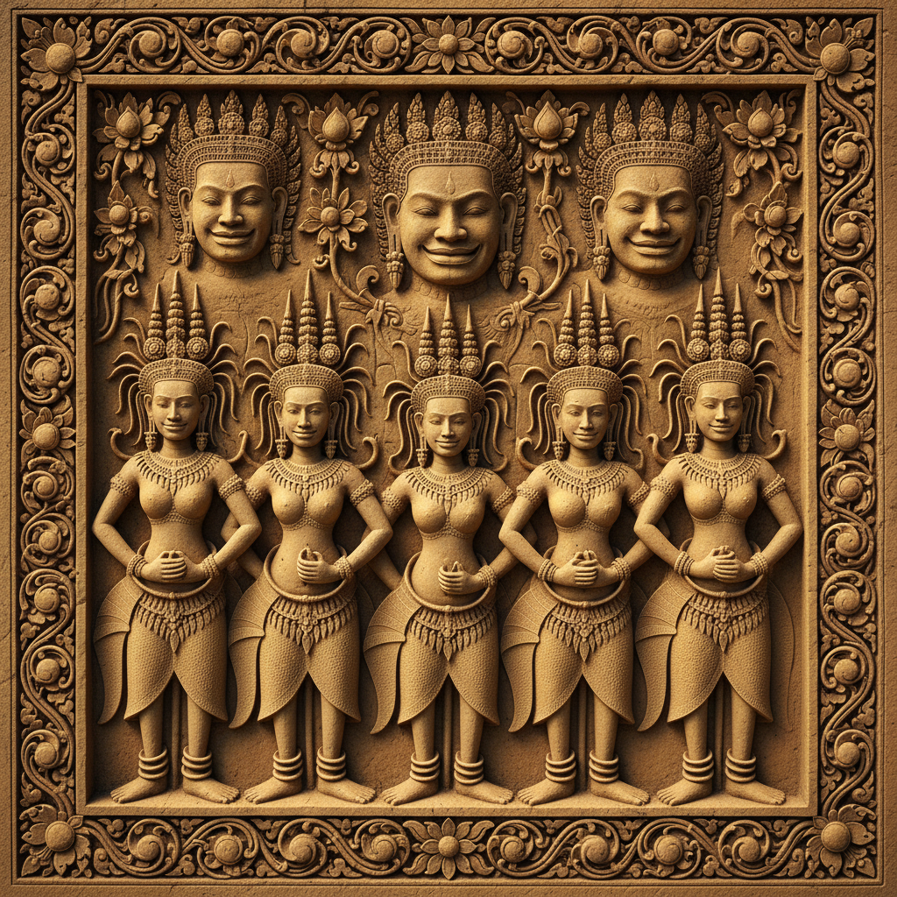

# Khmer Art 高棉艺术 | សិល្បៈខ្មែរ

> **"吴哥窟的微笑——石头上的天堂，浮雕中的史诗。"**

## 概述

高棉艺术（Khmer Art / សិល្បៈខ្មែរ）是柬埔寨高棉帝国（802–1431年）创造的辉煌视觉艺术传统，以吴哥窟（Angkor Wat）为最高成就。高棉艺术融合了印度教和佛教的宗教图像学，发展出独特的雕塑、建筑装饰和浮雕叙事传统。吴哥窟的浮雕长廊总长超过800米，是世界上最长的连续浮雕叙事，描绘了《摩诃婆罗多》《罗摩衍那》和高棉历史。巴戎寺（Bayon）的216张巨大微笑面容是高棉艺术最具辨识度的形象。

## 主要时期

| 时期 | 特征 |
|------|------|
| 前吴哥 (6–8世纪) | 印度影响强，独立雕塑 |
| 吴哥早期 (9–10世纪) | 建筑装饰发展 |
| 经典期 (11–12世纪) | 吴哥窟，巅峰时期 |
| 巴戎期 (12–13世纪) | 巴戎寺，佛教转向 |
| 后吴哥 (14世纪–至今) | 木雕和绘画传统 |

## 核心特征

- **建筑雕塑一体**：雕塑与建筑不可分割
- **浮雕叙事**：长卷式的连续故事浮雕
- **天女 Apsara**：优雅的天界舞者形象
- **那伽 Naga**：多头蛇神，建筑守护者
- **微笑面容**：巴戎寺的神秘微笑
- **莲花母题**：佛教纯洁象征贯穿装饰

## 主要艺术形式

| 形式 | 特征 |
|------|------|
| 砂岩浮雕 | 吴哥窟长廊的史诗叙事 |
| 独立雕塑 | 毗湿奴、湿婆、佛陀像 |
| 门楣装饰 | 精美的建筑门楣浮雕 |
| Apsara天女 | 数千个独特的舞者浮雕 |
| 当代丝绸 | 传统图案的丝绸织造 |

## 视觉特征

- 砂岩的温暖金色调
- 精细的浮雕层次（高浮雕到浅浮雕）
- 优雅的人体比例和姿态
- 精美的头饰和珠宝细节
- 植物蔓藤的装饰性填充
- 对称的建筑构图

## 与其他风格的关系

| 风格 | 关系 |
|------|------|
| 印度古典雕塑 | 直接源流，但独立发展 |
| 爪哇艺术（婆罗浮屠） | 共享东南亚印度化传统 |
| 泰国艺术 | 高棉影响泰国早期艺术 |
| 占婆艺术 | 邻国的姊妹传统 |
| 巴厘岛艺术 | 共享印度教视觉传统 |

## 概念图

---

*浮光艺志 | Chronicle of Artistry*
