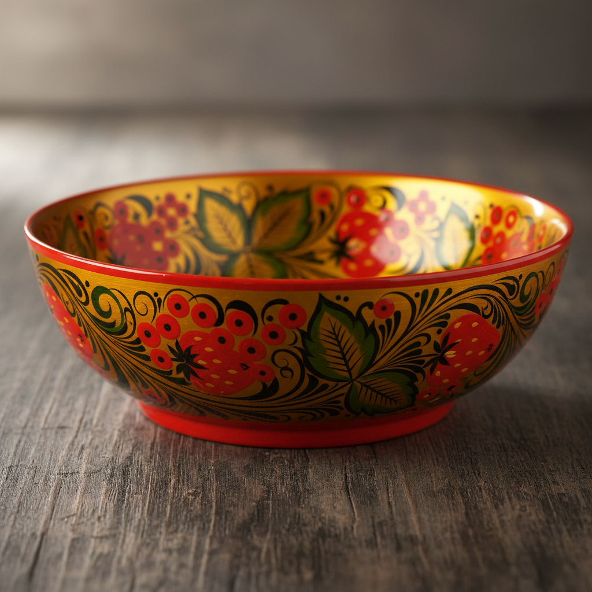

# Khokhloma 霍赫洛马 | Хохлома

> **"不用一克黄金，却闪耀金色光芒——俄罗斯森林里的金色餐桌。"**

## 概述

霍赫洛马（Khokhloma / Хохлома）是俄罗斯下诺夫哥罗德州的传统木器装饰绘画艺术，起源于17世纪。这种工艺以其独特的"假金"效果著称——不使用任何黄金，却通过锡粉（后改为铝粉）和多层漆的烘烤工艺，使木器表面呈现出金色的光泽。霍赫洛马的经典配色是金色、红色和黑色，图案以浆果（花楸果、草莓）、花卉和蔓藤为主。这种工艺至今仍在生产，是俄罗斯最具辨识度的民间艺术之一。

## 制作工艺

1. **木器车削**：椴木车削成勺、碗、盘等器形
2. **底漆**：涂抹亚麻油底漆
3. **锡粉/铝粉**：涂抹金属粉末
4. **绘画**：在银色表面上绘制图案
5. **上漆**：涂抹透明漆
6. **烘烤**：在窑中烘烤，漆变为金色

## 两种主要画法

| 画法 | 俄语名 | 特征 |
|------|--------|------|
| 上绘法 | Верховая | 在金色底上画红色和黑色图案 |
| 底绘法 | Фоновая | 金色图案在红色或黑色底上 |

## 核心特征

- **金红黑三色**：经典配色方案
- **假金效果**：不用黄金却有金色光泽
- **浆果图案**：花楸果和草莓是标志性元素
- **蔓藤纹**：流畅的卷曲藤蔓连接各元素
- **木器载体**：勺、碗、盘、花瓶等日用器皿
- **耐热耐用**：可盛放热食，不怕水

## 常见图案

| 图案 | 特征 |
|------|------|
| 花楸果 Рябина | 红色圆形浆果串 |
| 草莓 Земляника | 红色心形浆果 |
| 蔓藤 Травка | 流畅的草叶纹 |
| 花卉 | 程式化的花朵 |
| 鸟类 | 火鸟等装饰性鸟 |

## 视觉特征

- 金色底上的红黑图案（或反之）
- 金属般的光泽质感
- 流畅的蔓藤和浆果
- 温暖的红金色调
- 圆润的木器造型
- 精细的手绘笔触

## 与其他风格的关系

| 风格 | 关系 |
|------|------|
| Zhostovo托盘画 | 共享俄罗斯漆器装饰传统 |
| Petrykivka | 共享东斯拉夫花卉装饰 |
| 日本漆器（蒔絵） | 共享漆器金色装饰传统 |
| 中国漆器 | 共享漆器工艺传统 |
| 当代俄罗斯设计 | Khokhloma是俄罗斯视觉身份 |

## 概念图

---

*浮光艺志 | Chronicle of Artistry*
